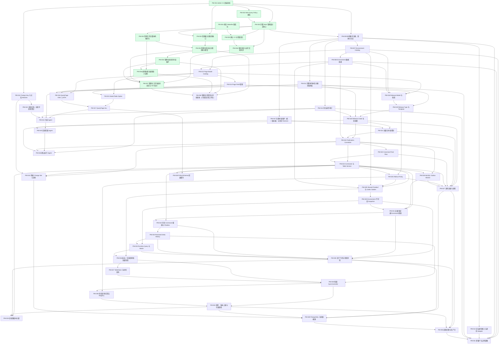

# 三个月功能排期与依赖 DAG（讨论稿）

依据：[Notion 项目总表](https://app.notion.com/p/3ca8544cc98980559f27e17f2c94cbaf)及[功能蓝图](https://app.notion.com/p/3ca8544cc989803da4f9f65ad1e94cf7)，读取时间 2026-09-07。状态优先采用项目总表；未独立核查提交与合并状态。

## 排期口径

- 人力：用户本人 + AI，串行推进；无并行开发线、额外测试人员或独立评审产能假设。
- 计划窗口：2026-09-07 至 2026-12-07。9 月 7 日做计划，9 月 8 日起实施；周末不排开发，10 月 1–7 日预留休息。这是计划工作日口径，未核对法定调休；其他请假需相应调整。
- 58 个工作包：12 个已完成，46 个待交付。已完成项不虚构历史 DDL，标记截至日期。
- 以下日期是为满足三个月目标分配的**倒排预算，不是经过规格拆解和速度校准的工期估算或承诺**。多数工作包只有 1–2 天，尤其研究、多数据源、多租户和生产化明显高风险。AI 不消除串行验收和设计决策所需时间。
- 各项日期包含该工作包实现、相关界面、测试和文档；后续才出现的集成场景随消费方验收。全链路最终验收截止 12 月 7 日。不得用 mock 通过代替真实端到端交付。
- 为覆盖“每一项”，后续触发的 PM-010/048/049/050/051 也分配目标日期，但是否启动及完整验收范围必须在 9 月 11 日前明确。未确认不能被默认为已承诺，也不能以完成研究代替功能完成。
- PM-047 首期按总表明确的记录级乐观锁验收；历史 Revision、Policy 并发与自动合并仍为后续范围，没有被这份日期默默纳入。若用户要求连这些远期子能力也全做，需要进一步拆项和重排。

## 依赖修正建议（未修改 Notion 原记录）

1. PM-028 大盘需要真实 Server/Client 状态；PM-040 又依赖 PM-028，会形成语义上的环。将“状态上报契约”提前在 PM-029 协议阶段冻结，PM-040 实现上报，PM-035 提供 Server 状态，最后 PM-028 展示真实数据。图中删去 028→040，增加 040→028、035→028。
2. PM-022 要同事务写 Command/版本/Outbox，而 PM-024 在其后。PM-021 结束前先冻结三者表结构和写入契约；PM-022 实现原子提交，PM-023 验证最终行，PM-024 完整交付编码与版本规则。这是分阶段实现，不能把 PM-022 的桩写入算作原子链路验收。
3. PM-018 冻结模板快照而 PM-019 才交付模板管理：在 PM-018 阶段明确模板快照格式，PM-019 完成版本化模板和集成。PM-020 的执行/回滚流程在 PM-022/025 完成后再验真实执行；阶段完成与端到端完成分别记录。
4. 为页面、发布、Runtime 补充 PM-008 隔离依赖；将 PM-047 提前到批量发布前，保持记录 lock_version 与发布/Table Version 的用途区分。
5. 将“Server 状态”“单 MySQL 成熟”“生产化”等自然语言依赖落实为具体 ID。PM-044 若验收包括关系解释，依赖 PM-042；PM-051 保守沿用原表企业身份依赖，但它是否为多租户必需项仍可单独决策。
6. 图中的边均表示前置交付或明确的数据契约先完成；审计、角色、页面展示在后续功能中的接入属于后续项验收，不能反过来添加环。跨包真实集成于最终验收统一检查。

## 每项目标 DDL（按串行执行顺序）

所有日期为 2026 年。直接前置列为排期建议；原始前置保存在 CSV 中以便比较。

|顺序|ID|功能|开始|目标 DDL|预算工作日|直接前置|
|---:|---|---|---|---|---:|---|
|1|PM-009|本地账号注册、登录与会话|09-08|09-08|1|PM-001、PM-003|
|2|PM-058|管理台可靠性与持续验收（六阶段后续工作包）|09-09|09-09|1|PM-054、PM-055、PM-056、PM-057|
|3|PM-007|Environment Catalog|09-10|09-10|1|PM-009|
|4|PM-008|Environment 数据隔离|09-11|09-14|2|PM-007|
|5|PM-011|完整角色体系与服务端授权|09-15|09-15|1|PM-009|
|6|PM-012|持久操作审计|09-16|09-16|1|PM-009|
|7|PM-047|乐观并发保护（统一版本表）与历史 Revision|09-17|09-17|1|PM-009|
|8|PM-013|Page Model Catalog|09-18|09-18|1|PM-007、PM-008|
|9|PM-014|Page Field 管理|09-21|09-21|1|PM-013|
|10|PM-015|Static/Table Option|09-22|09-22|1|PM-013、PM-014|
|11|PM-016|QueryPage ONLY_DATA|09-23|09-23|1|PM-013、PM-014、PM-011|
|12|PM-017|QueryPage ALL|09-24|09-24|1|PM-015、PM-016|
|13|PM-018|Release Model 与快照|09-25|09-25|1|PM-013、PM-014、PM-007、PM-008|
|14|PM-019|Release Type 与 Template|09-28|09-28|1|PM-011、PM-018|
|15|PM-020|Release Order 生命周期|09-29|09-30|2|PM-019、PM-011、PM-012|
|16|PM-021|批量与并发控制|10-08|10-08|1|PM-020、PM-047|
|17|PM-022|Publication Committer|10-09|10-12|2|PM-020、PM-021、PM-008|
|18|PM-023|Canonical Final Row|10-13|10-13|1|PM-022|
|19|PM-024|Command 与 Table Version|10-14|10-15|2|PM-022、PM-023|
|20|PM-025|Rollout Policy|10-16|10-16|1|PM-019、PM-024|
|21|PM-026|MySQL Outbox Worker|10-19|10-19|1|PM-022、PM-024|
|22|PM-029|Shared Protobuf 与 Codec Golden|10-20|10-20|1|PM-024、PM-025、PM-007、PM-008|
|23|PM-030|Environment 不可变 Snapshot|10-21|10-21|1|PM-029|
|24|PM-031|全量/指定表/Command 刷新|10-22|10-22|1|PM-024、PM-026、PM-030|
|25|PM-032|可信 Command 重放与 Shadow|10-23|10-23|1|PM-024、PM-031|
|26|PM-033|Resolved Delta History|10-26|10-26|1|PM-032|
|27|PM-034|Runtime Query 与 Watch|10-27|10-28|2|PM-030、PM-033|
|28|PM-036|启动、生命周期和全量快照|10-29|10-29|1|PM-029、PM-034|
|29|PM-037|TableStore 与本地查询|10-30|10-30|1|PM-036|
|30|PM-038|增量 SyncController|11-02|11-03|2|PM-033、PM-036、PM-037|
|31|PM-039|灰度查询与算法 Registry|11-04|11-04|1|PM-025、PM-038|
|32|PM-040|事件、版本上报与可观测性|11-05|11-05|1|PM-038、PM-039|
|33|PM-035|生产门禁与可观测性|11-06|11-06|1|PM-030、PM-031、PM-032、PM-033、PM-034|
|34|PM-028|全链路版本大盘|11-09|11-09|1|PM-024、PM-035、PM-040|
|35|PM-027|发布运维与巡检|11-10|11-10|1|PM-020、PM-021、PM-022、PM-023、PM-024、PM-025、PM-026|
|36|PM-041|Foreign Key 与关系 Allowlist|11-11|11-11|1|PM-001|
|37|PM-042|关联查询、动态字段和聚合|11-12|11-13|2|PM-041|
|38|PM-043|跨表 Change Set 与发布|11-16|11-16|1|PM-022、PM-024、PM-041|
|39|PM-044|只读 Agent|11-17|11-17|1|PM-017、PM-011、PM-012、PM-042|
|40|PM-045|变更草案 Agent|11-18|11-18|1|PM-044、PM-020|
|41|PM-046|确认执行 Agent|11-19|11-19|1|PM-012、PM-045、PM-022、PM-047|
|42|PM-010|企业身份接入与身份 Adapter|11-20|11-20|1|PM-009|
|43|PM-048|Policy/Schema/页面缓存|11-23|11-23|1|PM-017、PM-024|
|44|PM-049|PostgreSQL 与多数据源|11-24|11-25|2|PM-027、PM-035、PM-040、PM-043|
|45|PM-050|部署迁移与生产化|11-26|11-27|2|PM-027、PM-035、PM-040、PM-049|
|46|PM-051|多租户与公网部署|11-30|12-01|2|PM-007、PM-008、PM-009、PM-010、PM-011、PM-012、PM-050|

## 已完成项

以下按 Notion 状态记录，截至 2026-09-07，不推断实际历史完成日。总表内部分旧行仍写未合并，PM-058 则记录 MR #42 已合并，状态文字需后续统一。

|ID|功能|DDL / 状态|
|---|---|---|
|PM-001|Admin V1 后端基线|已完成，不新设 DDL|
|PM-002|Web Query Policy 基线|已完成，不新设 DDL|
|PM-003|完整 Web 管理面分支收口|已完成，不新设 DDL|
|PM-004|修复 Makefile 假成功|已完成，不新设 DDL|
|PM-005|建立 CI 与完整回归|已完成，不新设 DDL|
|PM-006|项目状态与运行文档同步|已完成，不新设 DDL|
|PM-052|管理面关键流程收口|已完成，不新设 DDL|
|PM-053|管理工作台整体风格优化|已完成，不新设 DDL|
|PM-054|管理台真实全流程验收与修复|已完成，不新设 DDL|
|PM-055|管理台未保存内容保护|已完成，不新设 DDL|
|PM-056|规则效果与编辑语义说明|已完成，不新设 DDL|
|PM-057|管理台工作包最终回归与 #22 核对|已完成，不新设 DDL|

## 完整工作包 DAG

包含全部 58 个节点。绿色为总表已完成项。图只表达依赖，不表示并行投入；实际执行使用上表的串行顺序。

## 交付风险与重排规则

- 最长依赖链集中在页面模型 → 发布 → 原子变更 → 协议 → Server 增量 → Go Client → 版本大盘。但对单人串行计划，所有选中项都会占用总工期，短链上的远期功能也不能免费并行。
- 9 月 11 日：明确研究项验收边界、SSO 身份源、多数据源支持矩阵、租户隔离方式及生产容量目标；至少拆解 PM-042/049/050/051 后再评估三个月全量可行性。
- 每交付 5 项，比较实际耗时与预算，重新计算剩余项；任何超期都必须反映到后续日期，不能仅保留原 DDL。
- 若不允许延长日期，建议优先保证 PM-007～009、011～040、047、058 的单 MySQL / Go 主链；优先移出 PM-010、041～046、048～051 等扩展项。移出范围需用户决定，此稿没有擅自删项。
- 12 月 7 日的完成标准：选定范围合入主干、CI 与真实 MySQL 集成通过，关键 Web/发布/Server/Client 链路验收，迁移回滚及故障恢复演练完成，文档及 Notion 同步。若要求全量，包含公网多租户与 PostgreSQL 的独立验收证据。

最后一个功能目标日期：2026-12-01。其后至 12 月 7 日用于总体验收与修复；该缓冲很短，无法覆盖未定范围的大幅膨胀。

校验：58 个工作包均覆盖；46 项串行排期无重叠；使用拓扑顺序检查所有建议依赖，无环且前置在后置之前交付。未验证工期估算可行性。
