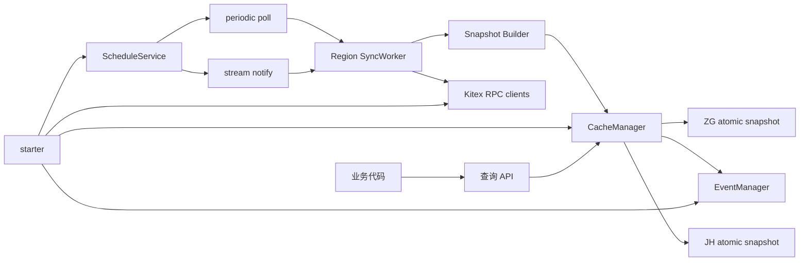
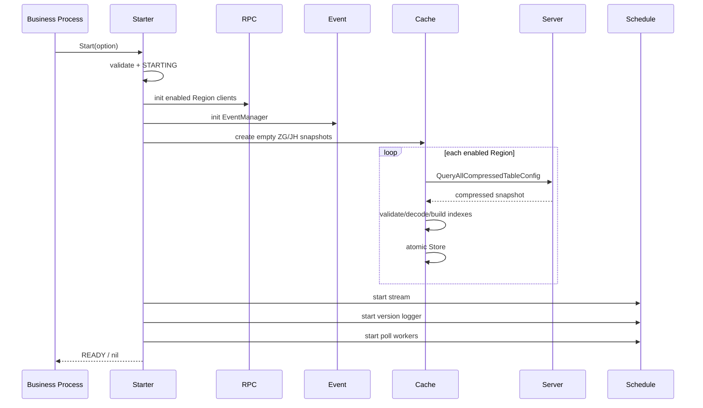
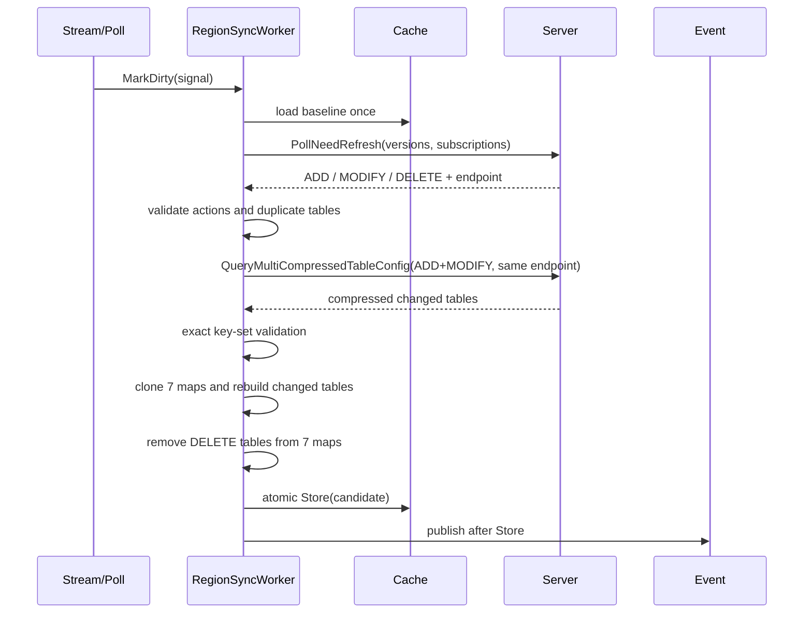

# Fin Config Client v2 复刻与落地技术方案

## 1. 方案摘要

本方案要建设一个嵌入业务进程的 Go 配置 SDK。SDK 从 Fin Config Server 拉取压缩配置，在本地构建 ZG/JH 两个 Region 的不可变快照，为业务提供无网络、无读锁的查询接口。

方案的核心路径是：

```text
启动全量拉取
    -> LZ4 流式解码
    -> 构建 TableStore 和 rowID 索引
    -> Region 级原子发布
    -> 业务本地查询

stream 通知 / 定时 poll
    -> 版本比较
    -> 定向同一服务端拉取变更表
    -> Copy-On-Write 构建新快照
    -> 一次原子替换
    -> 发布进程内更新事件
```

落地时保留当前 v2 的对外 API、RPC 协议、压缩格式和查询结果语义，同时修复五个会影响生产可用性的实现缺口：

1. 启动状态能区分 starting、ready 和 failed，失败后可重试。
2. Region 只允许空值、ZG、JH，非法值不再落到 JH。
3. 公开 API 的 panic 转成明确 error，不与合法 cache miss 混淆。
4. 每个查询仅读取一次快照，校验和取数使用同一代数据。
5. 增量响应执行精确 table key-set 校验，不发布元数据和表数据错位的快照。

## 2. 建设目标

### 2.1 功能目标

- 支持 ZG、JH 独立配置快照。
- 支持只读本 Region、只读跨 Region 或同时读两个 Region。
- 支持全表、一对一订阅、一对多订阅、泛型结构体、业务百分比灰度和版本查询。
- 支持启动全量、stream 低延迟通知、poll 最终一致和 panic 后全量自愈。
- 更新后发布进程内事件，业务 listener 可回读新快照。

### 2.2 工程目标

- 读路径不发起 RPC，不获取刷新锁。
- 同一 Region 任意时刻只有一个可见完整快照。
- 刷新失败继续使用旧快照，不出现局部更新。
- stream 不可用时，客户端仍可在 poll 周期内收敛。
- 后台 goroutine 统一通过 `SafeGo` 启动并具备 panic recovery。

### 2.3 非目标

- 不改造 Fin Config Server 的数据库、发布和版本生成逻辑。
- 不引入本地持久化快照。
- 不在查询失败时自动跨 Region 降级。
- 本期不合并 Maintenance、without-stream 和 Go 1.18 物理 module；通用修复通过同步矩阵传递。
- 不重新设计一套新的实例化公开 API。

## 3. 兼容边界

| 类别 | 必须兼容 | 允许修正 |
|---|---|---|
| 导入路径 | `.../fin_config_client_v2/api`、`.../starter`、`.../common` | 不允许变更 |
| 启动参数 | `StartOption`、`RegionConfig` 及 option 函数 | 非法值改为显式 error |
| RPC | 方法名、Thrift 字段、`CI000000` 成功码 | 增加本地响应完整性校验 |
| 压缩 | 稳定 JSON + LZ4 frame | 坏数据改为整批拒绝 |
| 查询 | 函数签名、合法请求结果、miss 返回 nil | panic/未启动/非法 Region 返回 error |
| 事件 | 保留现有事件名和 `TableNameList` | payload 增加 `Region`，旧 listener 可忽略 |
| 顺序 | 全表和一对多不承诺稳定顺序 | 业务不得依赖返回顺序 |

## 4. 整体架构



### 4.1 分层职责

| 模块 | 职责 | 不允许承担的职责 |
|---|---|---|
| `starter` | 配置校验、初始化编排、启动状态 | 不写查询和索引逻辑 |
| `api` | 参数校验、Region 解析、只读结果包装 | 不进行 RPC，不修改快照 |
| `application` | poll、版本日志、panic 自愈编排 | 不感知紧凑行存储细节 |
| `domain/service/cache` | 快照、TableStore、索引、查询、COW 更新 | 不创建全局 RPC client |
| `domain/service/stream` | 建流、心跳、接收通知、重连 | 不直接写 cache |
| `domain/service/event` | listener 注册和异步分发 | 不在持锁时调用业务 handler |
| `infra/rpc` | Region 到 PSM/cluster 的受控路由和 Kitex adapter | 不接受业务请求传入任意 endpoint |

### 4.2 代码目录

```text
fin_config_client_v2/
  common/
    region.go                 # StartOption、RegionConfig、默认值
    constant/                 # action、event、separator、subscription type
  starter/
    starter.go                # Start 状态机和初始化编排
  api/
    model.go                  # request、Version、ReadOnlyMap
    map_cache_query_service.go
    struct_cache_query_service.go
    biz_gray_cache_query_service.go
    version_query_service.go
  application/
    schedule_service.go       # poll/log/stream 编排
    poll_recovery.go          # poll panic 后全量重建
  domain/service/cache/
    client_cache_manager.go   # 双 Region 快照与锁
    table_store.go            # 紧凑行存储
    client_cache_init.go      # 全量构建
    client_cache_poll.go      # 版本比较
    client_cache_refresh.go   # COW 增量更新
    client_cache_query.go     # 快照内查询
    client_cache_diff.go      # 全量恢复 diff
    sync_worker.go            # 每 Region dirty 合并与串行同步
  domain/service/event/
  domain/service/stream/
  infra/rpc/
```

## 5. 配置设计

### 5.1 公开配置

```go
type StartOption struct {
    CurrentRegion     string
    IsNeedIntraRegion bool
    IsNeedCrossRegion bool
    JHRegionInfo      RegionConfig
    ZGRegionInfo      RegionConfig
}

type RegionConfig struct {
    ForbiddenStream   bool
    WithEnvLane       bool
    LogInterval       time.Duration
    HeartBeatInterval time.Duration
    PollInterval      time.Duration
    ServerCluster     string
}
```

### 5.2 默认值

| 配置 | 默认值 |
|---|---|
| 同 Region 读 | 开启 |
| 跨 Region 读 | 关闭 |
| stream | 开启 |
| env lane | 关闭 |
| 版本日志周期 | 5s |
| 心跳周期 | 5s |
| poll 周期 | 15s |
| server cluster | `default` |

### 5.3 配置校验

- `CurrentRegion` 必须为 `ZG` 或 `JH`。
- `IsNeedIntraRegion` 和 `IsNeedCrossRegion` 至少一个为 true。
- 周期小于等于 0 时在 Start 前归一化为默认值。
- `ServerCluster` 为空时归一化为 `default`。
- 生产环境禁止把 env lane 写入 Kitex context。
- API 中 `ConfigRegion=""` 表示当前 Region；非空值只接受 `ZG` 和 `JH`，且目标 Region 必须已启用。

### 5.4 服务路由

| Region | Server PSM |
|---|---|
| ZG | `caijing.bytepay.channelinfo` |
| JH | `caijing.bytepay.channelinfo_zg` |

RPC 请求中的 `PSM` 是当前宿主业务服务名，不是上表的被调服务名。客户端环境取值规则：PPE/BOE 使用实际 env，其他环境按 `prod`；只有 prod 传递 deploy stage。

## 6. RPC 与压缩协议

### 6.1 RPC 方法

| 方法 | 用途 | 调用时机 |
|---|---|---|
| `QueryAllCompressedTableConfig` | 查询一个 Region 的全量快照 | 启动、panic 恢复 |
| `PollNeedRefresh` | 提交本地版本/订阅，返回 ADD/MODIFY/DELETE | poll tick、stream notify |
| `QueryMultiCompressedTableConfig` | 拉取 ADD/MODIFY 表的完整新数据 | Poll 确认有变化后 |
| `StreamNotify` | 双向流心跳和变更提示 | stream 开启时 |

所有普通响应只有 `RetCode == "CI000000"` 才视为成功。RPC error、nil response、非成功码、协议校验失败都必须保留旧快照。

### 6.2 全量/多表响应语义

```go
type CompressedSnapshotResponse struct {
    RetCode               string
    RetMsg                string
    SubscriptionMap       map[string][]Subscription
    TableVersionMap       map[string]TableVersion
    TableDefineMap        map[string]TableDefine
    CompressedTableDataMap map[string][]byte
    GrayConfigMap         map[string][]GrayConfig
}
```

map key 都是 table name。全量响应中，version、define 和 compressed data 的 table set 必须相同；subscription/gray 可以是子集。多表响应中，subscription、version、define 和 compressed data 的 key set 必须等于请求的 ADD/MODIFY table set，没有订阅的表用空 list 表示。

### 6.3 稳定压缩格式

原始单表逻辑结构为：

```go
map[PrimaryKey]map[FieldName]FieldValue
```

编码规则：

1. 主键升序。
2. 每行字段名升序。
3. 序列化为以下 JSON 数组。
4. 使用 `github.com/pierrec/lz4/v4` 兼容的 LZ4 frame 压缩。

```json
[
  {"key":"pk-1","value":[["field-a","value-a"],["field-b","value-b"]]},
  {"key":"pk-2","value":[["field-a","value-c"]]}
]
```

客户端使用 `lz4.Reader -> json.Decoder` 逐行构建 `TableStore`，不先解压成第二份完整大 map。首 token 不是 `[`、item 结构错误、重复主键、JSON 未完整结束或 LZ4 错误均使整张表构建失败。

## 7. 本地快照和紧凑存储

### 7.1 Region 快照

```go
type ClientCaches struct {
    RawTableSubscriptions     map[string][]Subscription
    IndexedTableSubscriptions map[string]map[string]Subscription
    TableVersionCache         map[string]TableVersion
    TableDefineCache          map[string]TableDefine
    TableDataMapCache         map[string]*TableStore
    IndexTableDataMapCache    map[string]map[string]*RowIDIndex
    WholeTableDataMapCache    map[string][]uint32
}
```

`CacheManager` 持有：

```go
type CacheManager struct {
    currentRegion string
    zgSnapshot atomic.Pointer[ClientCaches]
    jhSnapshot atomic.Pointer[ClientCaches]
    zgSync *RegionSyncWorker
    jhSync *RegionSyncWorker
}
```

快照不变量：

- 七个 map 始终非 nil。
- 发布后 map、slice、TableStore 和元数据均不可修改。
- 一张表的 version、definition、data、subscription 和索引来自同一候选构建。
- 删除表时必须同时从七个 map 移除。
- 对外不返回可修改的内部 map 和 slice。

### 7.2 TableStore

```go
type TableStore struct {
    columns     []string
    columnIndex map[string]int

    values      []string
    valueIndex  map[string]uint32

    rowValues   []uint32
    rows        []CompactRow
    primary     map[string]uint32
}

type CompactRow struct {
    offset     uint32
    width      uint32
    fieldCount uint32
}
```

valueID 0 表示字段不存在，真实 value 从 1 开始。相同字符串在一张表中只保存一份。每行保存连续 valueID 和 offset/width，订阅索引只存 rowID，不复制整行 map。

`RowRef` 必须实现：

```go
Get(field string) (string, bool)
GetValue(field string) string
GetLength() int
Range(func(field, value string) bool)
ToMap() map[string]string
```

`Get` 用 bool 区分“字段不存在”和“字段存在但值为空串”。`ToMap` 只用于结构体转换，返回新 map。

### 7.3 订阅索引

复合 key 按声明字段顺序取值，用 ASCII `0x1f` 连接：

```text
SubsKeysDef = "merchant_id,currency"
values      = ["m1", "USD"]
index key   = "m1\x1fUSD"
```

- 订阅键等于表唯一键时，直接使用 `TableStore.primary`。
- `OneToOne` 使用 `map[string]uint32`，相同 key 出现多行时候选快照失败。
- `OneToMany` 使用 `map[string][]uint32`。
- 全表索引保存所有当前可达 rowID。

## 8. 启动方案

### 8.1 状态机

```text
NOT_STARTED -> STARTING -> READY
                   |         |
                   v         v
                 FAILED    READY
                   |
                   +---- retry ----> STARTING
```

- 第一个 `Start` 调用进入 STARTING。
- 并发 `Start` 等待同一次启动结果，不能在全量快照就绪前返回 nil。
- 任一步返回 error 或 panic，状态转 FAILED，清理已创建资源后允许重试。
- 只有所有启用 Region 都完成全量发布，`Start` 才进入 READY 并返回 nil。

### 8.2 初始化顺序



全量构建在局部变量中完成。只有 RPC、RetCode、响应结构、解压、灰度合并和索引全部成功后才 Store。首次启动不发布业务更新事件。

stream 启动决策：`ForbiddenStream=true` 时跳过；普通 v2 只启动当前 Region stream；开启 stream 但首次建流失败时，为保持现有 Start 契约，本次 Start 返回 error 并清理已创建资源。需要允许“无 stream 启动、后台重连”的业务，应显式配置 `ForbiddenStream=true` 或使用 without-stream variant，不在本期暗改启动成功语义。

## 9. 更新和最终一致方案

### 9.1 统一同步入口

每个启用 Region 建立一个 `RegionSyncWorker`。stream callback 和 poll ticker 只提交 dirty 信号，不直接并发执行 RPC。

```go
type RegionSyncWorker struct {
    region string
    dirty chan SyncSignal // capacity=1
    snapshot *atomic.Pointer[ClientCaches]
    transport PingPongClient
}

type SyncSignal struct {
    Source string // poll | stream
    ServerAddr string
    ReleaseNumber string
}
```

合并规则：

- dirty channel 容量为 1，队列中已有信号时合并。
- 保留最新的非空 release number 和 server address。
- 同步执行期间再次变 dirty，当前轮结束后立即再执行一轮。
- 同 Region 从 Poll 到 Store 完全串行，ZG/JH 可并行。

### 9.2 增量同步流程



关键规则：

1. Poll request 使用本轮唯一 baseline 的 version 和 raw subscriptions。
2. ADD/MODIFY 拉取完整新表，客户端不做行级 patch。
3. Multi query 必须定向完成 Poll 的同一 server address，避免服务端实例间版本差。
4. 候选快照从 baseline 浅拷贝七个顶层 map，被更新的表使用全新 TableStore/索引。
5. Store 前任意错误直接丢弃 candidate。
6. Store 后再发事件，listener 回读必须能看到新快照。

### 9.3 stream

- 普通 v2 只建立当前 Region stream；跨 Region 新鲜度由 poll 保证。
- 心跳包含宿主 PSM、env、deploy stage 和 client ID。
- 通知只是“配置可能有变化”的提示，不把通知作为数据源。
- Recv error 或连续 3 次心跳 Send error 触发重连。
- 重连从 1s 开始指数退避，上限 10s，附加 0~500ms jitter。
- 所有 backoff 必须可由 stream context 取消，不使用不可打断的 `time.Sleep`。
- server address 提取对 nil RPCInfo、endpoint、tag 和 address 安全。

### 9.4 poll 和 panic 自愈

- 每个启用 Region 使用自己的 `PollInterval`。
- poll tick 生成新 log ID。
- 普通 RPC/RetCode/校验失败保留旧快照，下一次 tick 重试。
- tick 内发生 panic 时，保留 tick 前 baseline，立即对该 Region 执行全量重建。
- 全量重建失败时暂停该 Region 增量 poll，按 poll interval 继续重试全量。
- 重建成功后比较 baseline/new 的 version 和 subscription，发布至少一次变更事件，然后恢复增量 poll。

## 10. 查询 API 方案

### 10.1 公开类型

```go
type WholeTableQueryRequest struct {
    ConfigRegion string
    TableName string
}

type SubscriptionQueryRequest struct {
    ConfigRegion string
    TableName string
    SubsKeysDef string
    SubsKeyValues []string
}

type BizGrayQueryRequest struct {
    ConfigRegion string
    Percent int
    TableName string
    SubsKeysDef string
    SubsKeyValues []string
}

type VersionQueryRequest struct {
    ConfigRegion string
    TableName string
}

type Version struct {
    TableName string
    Version string
    ProdMD5 string
    GrayMD5 string
}
```

### 10.2 公开函数

```go
func QueryWholeTable(ctx context.Context, req *WholeTableQueryRequest) ([]*ReadOnlyMap, error)
func QueryListBySubscription(ctx context.Context, req *SubscriptionQueryRequest) ([]*ReadOnlyMap, error)
func QueryBySubscription(ctx context.Context, req *SubscriptionQueryRequest) (*ReadOnlyMap, error)
func QueryStructListBySubscription[T any](ctx context.Context, req *SubscriptionQueryRequest) ([]*T, error)
func QueryStructBySubscription[T any](ctx context.Context, req *SubscriptionQueryRequest) (*T, error)
func QueryBizGrayMap(ctx context.Context, req *BizGrayQueryRequest) (*ReadOnlyMap, error)
func QueryBizGrayStruct[T any](ctx context.Context, req *BizGrayQueryRequest) (*T, error)
func QueryVersion(ctx context.Context, req *VersionQueryRequest) (*Version, error)
```

### 10.3 统一查询步骤

1. 校验 req、table name、订阅字段和值、percent。
2. 解析 Region：空值转 current，ZG/JH 验证已启用，其他值报错。
3. 从对应 atomic pointer 只加载一次 snapshot。
4. 从该 snapshot 完成订阅定义校验、索引查找和行解析。
5. 用 `ReadOnlyMap` 包装 `RowRef`，不暴露内部 map。

返回语义：

- 合法未命中：`nil, nil`。
- 全表存在但没有行：非 nil 空 slice。
- 表版本不存在：`Version/ProdMD5/GrayMD5` 均为 `"0"`。
- 非法参数、非法/未启用 Region、SDK 未 ready、内部 panic：非 nil error。
- 一对一 API 命中多行：协议/索引错误。

### 10.4 泛型结构体转换

```go
type Example struct {
    ID string `mapKey:"id"`
    Enabled bool `mapKey:"enabled"`
    Weight int64 `mapKey:"weight"`
}
```

- `T` 必须是 struct。
- 只处理带 `mapKey` 标签的可导出字段。
- 支持 string、各宽度有符号 int、float32/64 和 bool。
- 行中缺失字段保留零值。
- 解析失败或未支持类型返回 error，不 panic。

### 10.5 业务百分比灰度

`gray_value` 规则：

- 空字符串：命中。
- 精确字符串 `[0,99]`：命中。
- 其他值格式为 `[start,end]`，`0 <= start < end <= 100`。
- percent 在闭区间内命中。
- 非法区间跳过当前行，不使整次查询失败。

当多条候选行同时命中时，按表唯一键升序选择第一条，避免 Go map 遍历导致结果不可重现。上线前通过 shadow 对比确认现有配置不依赖旧遍历顺序。

## 11. 灰度配置合并

服务端全量/多表响应包含生产表数据和 `GrayConfigMap`。灰度只在候选 TableStore 上合并，不修改已发布快照。

匹配规则：

1. gray env 不等于客户端 env：忽略。
2. 非 prod：env 匹配即应用，不比较 stage。
3. prod + gray deploy stage 为空：所有 prod stage 应用。
4. prod + gray deploy stage 非空：只在 stage 相等时应用。
5. ADD/MODIFY：以 gray content 覆盖整行。
6. DELETE：从 candidate primary index 删除该行。
7. 未知 action：整个 candidate 失败。

灰度合并完成后再统一构建订阅索引和全表 rowID 列表。

## 12. 事件方案

保留三个事件名：

- `UpdateTableDataEvent`
- `UpdateTableSubscriptionEvent`
- `CleanTableDataEvent`

更新 payload：

```go
map[string]interface{}{
    "TableNameList": []string{"table_a", "table_b"},
    "Region": "ZG",
}
```

规则：

- ADD、MODIFY、DELETE 均视为 data change。
- subscription 定义新增、变更、删除视为 subscription change。
- 表名去重并排序。
- 事件在新快照 Store 后异步发布。
- 分发语义是 at-least-once，listener 必须幂等。
- listener panic 由 `SafeGo` 边界恢复，不影响其他 listener。
- 注册表持锁期间只复制 listener 列表，不调用业务代码。

`CleanTableDataEvent` 不再直接将 live data 清成空洞。它的处理语义改为“对目标 Region/表发起强制重拉”；重拉失败保留旧快照。

## 13. 错误处理

```go
var (
    ErrNotReady = errors.New("fin config client not ready")
    ErrInvalidArgument = errors.New("invalid argument")
    ErrInvalidRegion = errors.New("invalid region")
    ErrRegionDisabled = errors.New("region disabled")
    ErrSubscriptionNotFound = errors.New("subscription not found")
    ErrSubscriptionType = errors.New("subscription type mismatch")
    ErrProtocol = errors.New("fin config protocol error")
    ErrInternal = errors.New("fin config internal error")
)
```

处理原则：

- API 用 `errors.Is` 可识别的 sentinel 包装上下文。
- 内部 panic 记录堆栈后返回 `ErrInternal`，不吞成 nil。
- RetCode 失败、响应 map 错位、解压失败和非法 action 归类为 `ErrProtocol`。
- 同步错误记录 region、operation、table names、release number 和 server address，不打印整表配置内容。
- 任意刷新错误不得清除旧快照。

## 14. 并发与内存规则

1. 业务查询只执行 atomic Load，不获取 sync worker 锁。
2. 每个 API 请求在函数开始处保存唯一 snapshot 指针。
3. 同 Region 只有一个 sync worker 可以构建/发布快照。
4. 顶层 map 浅拷贝后，只能替换变更表对应的 value，不修改共享的 TableStore。
5. Store 前候选快照不对外可见，Store 后禁止修改。
6. 事件 handler、stream Recv、heartbeat、reconnect、poll 和 logger 均通过 `SafeGo` 启动。
7. 日志不序列化整个 TableStore 和配置表。
8. rowID 使用 uint32，单表行数达到 `2^32` 时拒绝构建。

## 15. 可观测性

### 15.1 指标

| 指标 | 维度 | 作用 |
|---|---|---|
| `fin_config_client_ready` | - | SDK 是否就绪 |
| `fin_config_snapshot_tables` | region | 快照表数 |
| `fin_config_snapshot_build_ms` | region, full/delta | 候选构建耗时 |
| `fin_config_sync_total` | region, source, result | poll/stream 同步结果 |
| `fin_config_last_success_timestamp` | region | 最后成功同步时间 |
| `fin_config_stale_seconds` | region | 快照陈旧时长 |
| `fin_config_stream_connected` | region | stream 连接状态 |
| `fin_config_reconnect_total` | region, result | 重连结果 |
| `fin_config_recovery_total` | region, result | panic 自愈结果 |
| `fin_config_event_total` | event, result | 事件分发结果 |
| `fin_config_panic_total` | component | panic 计数 |

table name 不作为指标 label，避免高基数。逐表 version/prodMD5/grayMD5 使用结构化日志记录。

### 15.2 告警

- Start 超过宿主约定时间仍未 ready。
- 任一启用 Region 的 stale time 超过 `max(3*PollInterval, 60s)`。
- 连续出现协议校验错误或全量重建失败。
- stream 配置开启但长时间未连接。
- panic counter 增长。

## 16. 实施任务拆分

### 16.1 WP1：契约和测试基座

交付：

- 固化 StartOption、API request/response、RPC response 和压缩 golden sample。
- 构建 fake Fin Config Server，支持 full、poll、multi 和 stream。
- 建立包级兼容测试，记录现有合法请求结果。

预估：1.5 人日。

### 16.2 WP2：快照与 TableStore

交付：

- LZ4 流式 decoder、TableStore、RowRef、字符串字典。
- 唯一键/一对一/一对多/全表 rowID 索引。
- 全量 builder、灰度合并、七 map 快照校验。

预估：2.5 人日。

### 16.3 WP3：更新控制面

交付：

- RegionSyncWorker、dirty 合并、Poll/Multi sticky 路由。
- COW delta builder、DELETE 完整移除、Store 后事件。
- poll panic 恢复、全量重建和 baseline diff。

预估：3 人日。

### 16.4 WP4：stream、starter 和 API

交付：

- stream heartbeat/recv/reconnect/cancel。
- Start 状态机、失败清理和并发 Start。
- 全部查询 API、Region 校验、ReadOnlyMap 和 panic error 语义。
- 事件 Region payload 和 force-reload clean 语义。

预估：2.5 人日。

### 16.5 WP5：集成、性能和发布

交付：

- full -> stream -> poll -> multi -> Store -> event 全链路测试。
- race、fuzz、大表 benchmark、goroutine 泄漏检查。
- shadow 对比、dashboard、canary 和回滚手册。
- 普通、without-stream、Go 1.18、Maintenance variant 同步矩阵。

预估：2.5 人日，不含灰度观察时间。

单个熟悉 Go/Kitex 的工程师开发预估约 12 人日；WP2 和 WP3 可在 WP1 契约冻结后并行。

## 17. 验证方案

### 17.1 必测矩阵

| 领域 | 必测场景 |
|---|---|
| Start | 单/双 Region、参数错误、RPC 错误、RetCode 错误、解压错误、panic、并发 Start、失败后重试 |
| Codec | 空表、Unicode、引号/换行、坏 LZ4、坏 JSON、重复主键、未结束数组 |
| Store | 空字符串、字段不存在、覆盖清旧字段、删除不可达、重复 value 只存一份 |
| Index | 唯一键、复合键、OneToOne 冲突、OneToMany、删除后索引一致 |
| Query | nil、非法/未启用 Region、未 ready、miss、单快照、只读、泛型转换、灰度 |
| Delta | 空 diff、ADD/MODIFY/DELETE、未知 action、重复 table、等长错 key、sticky endpoint、失败保旧 |
| Concurrency | 同 Region 单 worker、跨 Region 并行、通知风暴合并、race detector |
| Recovery | poll 前/后 panic、重建多次失败、旧快照可读、baseline diff |
| Stream | Recv error、3 次 Send error、nil RPCInfo、退避取消、重连、Stop |
| Event | Region、去重排序、三种 action、listener panic、at-least-once、force reload |

### 17.2 性能验证

用同一批真实脱敏表对比 v1 和 v2：

- 全量启动峰值 RSS 和稳定 RSS。
- GC 次数和暂停。
- 全表、一对一、一对多的 ns/op、allocs/op、p95/p99。
- 单表/多表更新耗时和额外峰值内存。
- 1/100/1000 条 stream 通知突发时的实际 Poll/Multi RPC 次数。

验收线：v2 稳定 RSS 小于 v1；点查询 p99 较基线回归不超过 10%；通知风暴下同 Region 并发同步数始终为 1。

### 17.3 完成定义

- 有效请求与现有 v2 返回语义一致。
- 非法 Region、未 ready 和 panic 不再返回合法 miss。
- 故障注入下只能观察到旧完整快照或新完整快照。
- stream 关闭时，服务可达前提下在 `PollInterval + 一次成功同步耗时` 内收敛。
- 当前变更包的远程 UT 通过，变更代码覆盖率达到仓库门槛。
- race detector 无竞争，后台 goroutine 无泄漏。
- 普通和所有需同步 variant 的测试矩阵完成。

## 18. 发布与回滚

### 18.1 发布

1. 冻结 API/RPC/codec golden。
2. 非生产环境跑全量、增量、stream 断连和 panic 恢复。
3. 以 `v1.2.0` 发布普通 v2，不改 module path。
4. 单实例 shadow：业务仍使用旧结果，对比新旧查询结果。
5. 单集群小流量，至少经过一次配置发布和一次完整 poll 周期。
6. 单 Region 全量后再开启双 Region。
7. 普通 v2 稳定后，按同步矩阵发布 without-stream、Go 1.18 和 Maintenance。

shadow 对比时，全表/一对多结果先按唯一键排序，再比较字段，排除 map 顺序噪声。

### 18.2 回滚触发条件

- 任意有效查询数据不一致。
- 出现跨 Region 误读。
- 快照版本回退或 stale 超过上界。
- panic/recovery 持续增长。
- RSS、GC 或查询 p99 超出验收线。
- 事件重复导致业务非幂等副作用。

### 18.3 回滚动作

1. 调用方回退到上一个稳定 module tag。
2. 若使用双读开关，立即切回 old-primary。
3. 停止新 listener 的业务副作用。
4. 保留最后快照 version/MD5、sync、reconnect 和 recovery 日志。
5. 不通过清空 live cache 处理故障。

## 19. 关键风险和对策

| 风险 | 影响 | 对策 |
|---|---|---|
| Poll 和 Multi 命中不同服务端版本 | 拉到非 Poll 对应数据 | 绑定 Poll 返回的 server address，并校验返回 TableVersion |
| stream 通知风暴 | RPC 放大和旧响应覆盖 | 每 Region dirty channel 合并 + 单 worker |
| 多表响应 key 错位 | 混合快照 | 请求 table set 与四类 response map 做精确集合校验 |
| 解压大表峰值内存 | 宿主 OOM | LZ4 + JSON 流式构建，压测冻结单表/总快照容量上限 |
| 业务 listener 不幂等 | 恢复/重复事件导致副作用 | 接入评审检查幂等，事件文档明确 at-least-once |
| 普通和 variant 复制代码漂移 | 修复漏同步 | 每次变更强制填写 variant 矩阵并分别远程验证 |
| 百分比灰度多行重叠 | 返回结果不稳定 | 候选按唯一键排序，上线前 shadow 对比 |

## 20. 审计资料

本方案正文已包含实施所需的协议、结构、流程、规则和验收条件，开发不需要借助源码完善设计。如需核对方案与当前仓库实现的差异，使用独立审计文档：

- `docs/research/fin_config_client_v2_technical_design.md`
