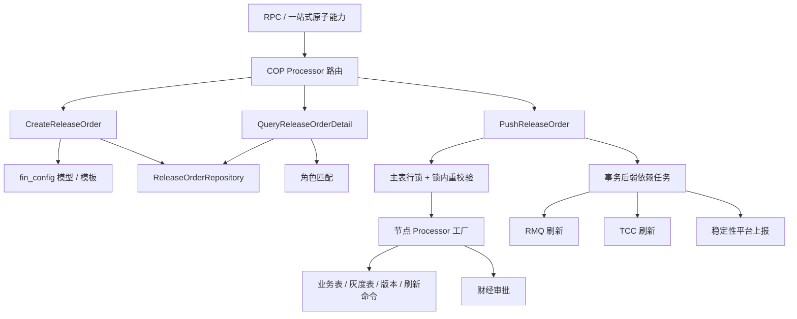
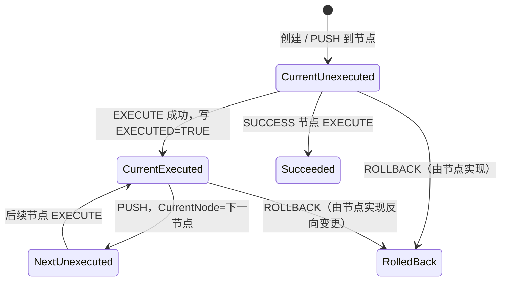

# 发布单实施技术规格

## 1. 文档定位

本文定义渠道运营平台（COP）发布单的可实施目标方案，并记录与当前实现的兼容关系。读者无需打开源码即可完成接口联调、数据建模、状态机实现、部署迁移和验收。

- **MUST**：上线前必须满足；不满足视为实现缺陷。
- **SHOULD**：原则上应满足；偏离时必须记录原因、风险和补偿措施。
- **MAY**：可选能力，不影响基础互操作。

目标方案以可靠性为优先级；附录集中记录现状源码证据、差异和风险。实现时 MUST 先完成兼容阶段，再启用目标能力。

## 2. 业务目标与范围

### 2.1 目标

发布单 MUST：

1. 用唯一单号关联申请人、配置模型、环境、变更内容、审批、执行节点、操作审计和外部刷新事件。
2. 将一次配置变更拆成可配置、可检查、可回滚、可追溯的节点序列。
3. 保证同一模型、环境和业务目标同时最多存在一张在途发布单。
4. 保证数据库变更、发布单状态和待投递事件具备可恢复的一致性边界。
5. 支持单笔与批量变更；批量每条明细 MUST 经过同级解析、校验、互斥和状态同步。
6. 支持上游一站式编排，但核心状态机的权威状态 MUST 只保存在 COP。

### 2.2 纳入范围

- 核心发布单创建、查询、推进、回滚和终态。
- 配置审核、测试、灰度、应急、数据库、Diff、流量回放和成功节点。
- 单笔/批量内容、模板与模型配置、权限、审批回调。
- 可靠事件投递、操作日志、审计、安全、监控和迁移。
- 一站式编排对核心接口的调用契约。

### 2.3 范围边界

| 对象 | 定位 | 是否属于本文核心状态机 |
| --- | --- | --- |
| COP ReleaseOrder | 渠道运营配置的流程权威载体 | 是 |
| One-stop ReleaseRecord | 上游需求与 COP 单号的关联台账 | 否，只能引用 COP |
| CAP DeploymentOrder | CAP 部署流程工单 | 否 |
| Intelligent Router ReleaseRecord | 智能路由试算/算法版本发布记录 | 否 |
| Record-only ReleaseOrder | 直改成功后补写的只读追踪记录 | 否，不允许推进 |

记录型发布单 MUST 显式标记 `mode=RECORD_ONLY`，查询可以复用详情协议，推进 MUST 返回“不支持的操作”。

## 3. 术语

| 术语 | 定义 |
| --- | --- |
| 发布模型（Model） | 一类可发布配置的字段、查询策略、变更表、主键、唯一键和自动填充规则。 |
| 发布类型（Release Type） | 同一模型下选择流程模板和频控的业务子类型。 |
| 发布目标（Target） | 从模型唯一键计算出的稳定业务标识。 |
| 模板（Template） | 有序节点、节点参数、监控链接和授权角色的配置。 |
| 模型快照 | 建单时冻结的 Model 配置及其版本。 |
| 模板快照 | 建单时冻结的 Template 配置及其版本。 |
| 节点上下文 | 每个节点的执行状态、审批状态、检查结果、外部任务号和扩展结果。 |
| 在途 | 总状态为 `IN_PROGRESS`。 |
| 动作 | `EXECUTE`、`PUSH`、`ROLLBACK`。 |
| Outbox | 与业务事务一起落库、由异步 worker 可靠投递的事件表。 |
| Active Target | 对“模型+环境+目标”的在途互斥占位。 |

## 4. 角色、权限与核心用例

### 4.1 角色

| 角色 | 权限 |
| --- | --- |
| Creator | 创建发布单、查看本人可见发布单；不能天然获得推进权。 |
| AuthorizedRole Member | 对要求该角色的发布单执行动作。 |
| ADMIN | 可查询和推进所有核心发布单；高危动作仍 MUST 审计。 |
| Approval Service | 创建审批并回调结果；仅允许服务身份调用回调。 |
| One-stop Orchestrator | 代表需求编排核心 API；不能直接写核心表。 |
| Outbox Worker | 投递刷新、稳定性、审批和回放事件；不能修改业务内容。 |
| Auditor/Read-only | 查看详情和审计记录，不得推进。 |

权限判定 MUST 使用服务端认证上下文主体，MUST 忽略客户端声明的 `Operator` 作为授权依据。`Operator` 仅为兼容字段；审计主体始终取认证上下文。

### 4.2 核心用例

| 用例 | 参与者 | 成功结果 |
| --- | --- | --- |
| 创建单笔/批量单 | Creator / One-stop | 主表、明细、互斥占位原子写入并返回唯一单号 |
| 查看发布单 | 有读权限主体 | 返回流程、内容、日志、可执行动作和事件摘要 |
| 执行当前节点 | AuthorizedRole / ADMIN | 节点完成或进入异步等待态 |
| 推进下一节点 | AuthorizedRole / ADMIN | 当前节点满足完成条件，游标前移 |
| 回滚 | AuthorizedRole / ADMIN | 反向动作完成，总状态进入 `ROLLBACK` |
| 审批回调 | Approval Service | 幂等更新对应审批节点 |
| 一站式编排 | Orchestrator | 只通过核心 API 驱动，不复制状态机 |

## 5. 组件职责

| 组件 | 职责 | 禁止事项 |
| --- | --- | --- |
| RPC Processor | 协议解析、基础校验、注入认证主体和请求 ID | 不承载状态机 |
| Application Service | 创建/查询/推进/回调编排和错误映射 | 不直接调用不可幂等外部写操作 |
| Model/Template Registry | 查询、版本化、校验配置 | 不向在途单静默注入破坏性变更 |
| State Machine / Node SPI | 动作矩阵、节点执行、回滚和节点结果 | 不绕过事务写核心表 |
| Repository | 行锁、CAS、事务和查询 | 不吞数据库错误 |
| Outbox Worker | 外部投递、重试、死信和人工重放 | 不改变已提交业务结果 |
| Callback Adapter | 验签、去重、审批实例关联 | 不按未校验参数任意选单 |
| One-stop Adapter | 保存 COP 单号和步骤快照、处理重试 | 不把本地快照当权威状态 |

~~~mermaid
flowchart LR
  Caller --> RPC[RPC Processor]
  RPC --> App[ReleaseOrder Service]
  App --> Registry[Model/Template Registry]
  App --> Repo[(Release DB)]
  App --> SM[State Machine + Node SPI]
  SM --> Repo
  Repo --> Outbox[(Outbox)]
  Worker[Outbox Worker] --> Outbox
  Worker --> Approval[Approval]
  Worker --> Refresh[RMQ/TCC Refresh]
  Worker --> CG[ChangeGate]
  Worker --> Replay[Flow Replay]
~~~

## 6. 功能清单

| 功能 | 必要行为 |
| --- | --- |
| 创建 | 校验身份、模型、模板和内容，逐条校验批量明细，抢占 Active Target，冻结配置快照 |
| 查询 | 返回权威状态、节点详情、内容、日志、事件摘要和当前主体可执行动作 |
| 推进 | 双重校验节点和版本、行锁串行、执行 SPI、同事务更新状态/日志/outbox |
| 审批 | 确定性幂等键发起；回调验签、验关联、CAS 更新 |
| 回滚 | 节点声明回滚能力；失败时保持在途并暴露可重试错误 |
| 频控 | 指定生产节点执行最小间隔；范围 MUST 明确为单内或全局 |
| 降级 | 全局禁止推进；查询和回调不受影响 |
| 角色授权 | 角色来自权威发布单；授权范围、有效期和审批证据可审计 |
| 可靠后置任务 | Outbox 至少一次投递，下游按幂等键去重 |
| 记录型发布 | 只读、成功态、不可推进，记录失败可独立补偿 |

## 7. API 规格

### 7.1 通用约定

- 传输沿用 Thrift/RPC；字段名按现有 UpperCamelCase 兼容。
- 目标协议的所有写请求 MUST 携带 `RequestId`；兼容旧调用方时可由服务端生成，但这种调用不具备跨重试幂等保证。相同主体、接口和 `RequestId` MUST 返回相同业务结果。
- `OperationBaseResponse` 包含：`RetCode:string`、`RetMsg:string`、`RetStatus:string`；业务成功 MUST 同时满足 `RetCode=CA000000` 和 `RetStatus=SUCCESS`。
- `RetMsg` MUST 是稳定摘要，不得包含敏感 SQL、堆栈或完整配置内容。

### 7.2 CreateReleaseOrder

请求：

| 字段 | 类型 | 必填 | 校验与语义 |
| --- | --- | --- | --- |
| ModelCode | string | 是 | 1..255；必须存在且启用 |
| ReleaseActionType | enum string | 是 | `ADD/MODIFY/DELETE` |
| ReleaseDesc | string | 是 | 1..2000；入库前 trim |
| ContentBefore | JSON string | 单笔是 | JSON object；ADD 可为空对象 |
| ContentAfter | JSON string | 单笔是 | JSON object；DELETE 可为空对象 |
| Env | string | 是 | 1..255；属于模型允许环境 |
| ReleaseTypeCode | string | 否 | 存在时属于模型发布类型 |
| ContentList | list<ContentChange> | 批量是 | 1..1000；每条含 before/after JSON object |
| ReleaseBatchType | enum string | 否 | 空按 `SINGLE`；仅 `SINGLE/BATCH` |
| ExtraInfo | map<string,string> | 否 | 序列化不超过 64 KiB；保留键禁止覆盖 |
| RequestId | string | 目标新增 | 1..128，写请求幂等键 |
| Base | object | 兼容 | 链路信息，不作为身份来源 |

校验顺序 MUST 为：认证 → 参数 → 模型/模板 → 逐条解析 → 自动字段归一化 → 模型专属校验 → 目标计算 → 数据存在性 → Active Target 互斥 → 原子写入。批量主表 before/after MAY 保留首条兼容值，但执行和详情 MUST 以明细表为权威。

核心接口 v1 的 BATCH 是“同一种动作的多条内容”：所有明细共享请求级 `ReleaseActionType`。如果未来需要一单混合 ADD/MODIFY/DELETE，MUST 以新版本协议在 `ContentChange` 中增加动作字段，并重新评审回滚顺序、目标冲突和审计展示；禁止通过 `ExtraInfo` 暗传。

响应字段：`ReleaseNumber:string`（全局唯一）、`OperationBaseResponse:object`（必填）、`BaseResp:object`（可选）。目标协议 SHOULD 同时返回 `ReleaseStatus`、`CurrentNode`、`Version` 和 `IdempotentReplay`。

### 7.3 QueryReleaseOrderDetail

请求包含必填 `ReleaseNumber:string`（长度 1..255）和兼容链路字段 `Base:object`。

| 响应字段 | 类型 | 语义 |
| --- | --- | --- |
| ReleaseNumber | string | 单号 |
| Operator | string | 兼容字段，语义为 AuthorizedRole |
| AuthorizedRole / Creator | string | 目标新增，角色与创建主体 |
| CurrentNode / ReleaseStatus | string | 当前节点；IN_PROGRESS/SUCCESS/ROLLBACK |
| OperationLogList | list<OperationLog> | 按 server_sequence 升序 |
| NodeDetailMap | map<string,NodeDetail> | 状态、检查项、审批/外部任务摘要 |
| NodeList / MonitorList | list | 冻结模板节点和监控 |
| CanOperate | bool | 兼容字段 |
| AllowedActions | list<string> | 目标新增，按身份、状态、降级和频控计算 |
| ReleaseType / ReleaseTypeDesc | string | 模型编码与描述 |
| ReleaseBatchType | string | SINGLE/BATCH |
| ContentBefore/ContentAfter | JSON string | 单笔权威值；批量首条兼容值 |
| ContentList | list<ContentChangeDetail> | 批量权威明细，含 target/action/status |
| ExtraInfo | map<string,string> | 敏感键脱敏 |
| EventSummary | object | pending/retrying/dead-letter 数量 |
| Version | i64 | 乐观并发版本 |
| OperationBaseResponse | object | 业务结果 |
| BaseResp | object | 可选框架返回 |

`NodeDetail` MUST 至少含 `NodeName`、`NodeCode`、`Status`、`PreCheckItemList`、`PostCheckItemList`、`NodeDetailInfo`。`OperationLog` MUST 至少含节点、主体、时间、动作、结果、request_id 和错误码。

### 7.4 PushReleaseOrder

| 请求字段 | 类型 | 必填 | 校验与语义 |
| --- | --- | --- | --- |
| ReleaseNumber | string | 是 | 权威发布单 |
| ActionType | enum string | 是 | `EXECUTE/PUSH/ROLLBACK` |
| Operator | string | 兼容必填 | 不参与鉴权；与认证主体不一致时记安全日志 |
| CurrentNode | string | 是 | 客户端观察节点；锁内再比较 |
| ExpectedVersion | i64 | 目标新增 | 推荐必填；不一致返回并发冲突 |
| ExtraInfo | map<string,string> | 否 | 仅允许节点声明键 |
| RequestId | string | 目标新增 | 幂等键 |
| Base | object | 兼容 | 链路信息 |

响应 MUST 含 `ReleaseNumber`、`CurrentNode`、`ReleaseStatus`、`Version` 和 `OperationBaseResponse`，MAY 返回兼容 `BaseResp`。同步节点成功表示事务已提交；异步节点成功表示任务已可靠写入 Outbox，节点处于等待态。

### 7.5 ApprovalCallback

请求 MUST 包含 `ClientKey`、`ApprovalKey`、`ApprovalInstanceId`、`IdempotencyKey`、`ReleaseNumber`、`NodeCode`、`Status(APPROVED/REJECTED/CANCELED)`、`EventTime`、`Signature`；`RejectReason` 可选。

服务端 MUST 验签、校验 client/approval key、按审批实例反查发布单、校验节点、按幂等键去重，并以行锁或 CAS 更新。乱序且与已落终态冲突的回调 MUST 返回 `CA020027`，不得覆盖。

### 7.6 ApplyOperationRole

| 请求字段 | 类型 | 必填 | 语义 |
| --- | --- | --- | --- |
| ReleaseNumber | string | 是 | 角色权威来源 |
| RequestId | string | 目标新增 | 写请求幂等键 |
| ReleaseType | string | 兼容必填 | 仅审批展示 |
| ReleaseTypeDesc | string | 否 | 仅展示 |
| GrantEvidenceId | string | 目标新增 | 审批/工单证据 |
| ExpireAt | timestamp | 目标新增 | 临时授权过期时间 |
| Base | object | 兼容可选 | 链路信息 |

服务端 MUST 从发布单读取角色，从认证上下文读取申请人；不得接受客户端指定角色。相同 `role+operator+evidence` 重试 MUST 幂等成功。

响应包含必填 `OperationBaseResponse` 和可选 `BaseResp`；重复申请已存在时仍返回成功。

### 7.7 RecordReleaseOrder（内部接口）

记录型发布仅供受信业务服务调用。请求 MUST 包含 `RequestId`、`SourceSystem`、`SourceTxnId`、`ReleaseNumber`、`ModelCode`、`Env`、`ReleaseDesc`、`ContentList` 和认证上下文；每条内容包含动作、before、after 和目标。服务端 MUST 校验来源 ACL，以 `SourceSystem+SourceTxnId` 幂等创建 `mode=RECORD_ONLY`、`release_status=SUCCESS` 的只读记录。

该接口不占用 Active Target，不执行模型变更，不发送刷新事件。成功响应包含 `ReleaseNumber`、`IdempotentReplay` 和通用响应。调用方业务事务与本服务跨库时，调用方 MUST 使用自身 outbox 可靠重试，不得以日志代替补偿。

### 7.8 错误码

| 错误码 | 含义 | 可重试 |
| --- | --- | --- |
| CA000000 | 成功 | 否 |
| CA010001 | 内部系统异常 | 是，同 RequestId |
| CA010002 | 动作/节点不支持 | 否 |
| CA020001 / CA020002 | 通用业务错误 / 参数错误 | 视原因 / 否 |
| CA020011 | 发布单已到终态 | 否 |
| CA020019 | 节点执行失败 | 视节点错误 |
| CA020023 | 发布间隔不足 | 到期后 |
| CA020024 | 缺少推进角色 | 授权后 |
| CA020025 | 发布单不存在（目标新增） | 否 |
| CA020026 | 节点或版本冲突（目标新增） | 查询后 |
| CA020027 | 审批回调冲突（目标新增） | 否 |
| CA020028 | 相同目标存在在途单（目标新增） | 复用/等待 |
| CA020029 | RequestId 对应的请求摘要冲突（目标新增） | 否 |
| CA020030 | 同一 RequestId 正在处理中（目标新增） | 稍后以原键重试 |
| CA030001 | 外部依赖失败 | Outbox 重试 |
| CA040001 | 权限/配置组件异常 | 是 |

兼容期 MUST 停止复用 `CA020012` 表示“发布单不存在”；旧调用方按 RetMsg 兼容，新调用方使用 `CA020025`。

## 8. 数据模型与索引约束

### 8.1 主表 `channel_operation_release_order`

| 字段 | 类型/空值 | 约束与语义 |
| --- | --- | --- |
| id | BIGINT UNSIGNED NOT NULL | PK, AUTO_INCREMENT |
| gmt_create/gmt_modified | TIMESTAMP NOT NULL | 默认当前时间；modified 自动更新 |
| creator/modifier | VARCHAR(255) NOT NULL | 认证主体 |
| authorized_role | VARCHAR(255) NOT NULL | 冻结模板角色 |
| release_number | VARCHAR(255) NOT NULL | UNIQUE |
| client_id/create_request_id | VARCHAR(128) NOT NULL | 创建调用方和幂等键 |
| create_request_digest | CHAR(64) NOT NULL | 规范化请求摘要 |
| release_action_type | VARCHAR(32) NULL | ADD/MODIFY/DELETE |
| release_type / release_type_desc | VARCHAR(255)/VARCHAR(500) | 模型编码与展示描述 |
| release_target / release_target_desc | VARCHAR(255)/VARCHAR(500) | 单笔目标与展示值 |
| release_status | VARCHAR(32) NOT NULL | IN_PROGRESS/SUCCESS/ROLLBACK |
| release_desc | VARCHAR(2000) NULL | 变更描述 |
| node_list | TEXT NOT NULL | 有序节点快照 |
| node_list_context | JSON/TEXT NOT NULL | 节点运行态 |
| current_node | VARCHAR(255) NOT NULL | 节点游标 |
| monitor_list | JSON/TEXT NULL | 监控快照 |
| content_before/content_after | LONGTEXT NULL | 单笔内容/批量首条兼容内容 |
| operation_log | TEXT NULL | 旧版兼容列；迁移完成后只读，目标日志以独立表为权威 |
| extra_info | JSON/TEXT NULL | 受控扩展信息 |
| template_snapshot | JSON/TEXT NOT NULL | 模板完整快照 |
| model_snapshot | JSON/TEXT NOT NULL | 目标新增，模型完整快照 |
| env | VARCHAR(255) NOT NULL | 环境 |
| release_batch_type | VARCHAR(32) NOT NULL | 默认 SINGLE |
| mode | VARCHAR(32) NOT NULL | WORKFLOW/RECORD_ONLY |
| version | BIGINT NOT NULL | 默认 1；状态变更 +1 |
| source_system/source_txn_id | VARCHAR(128) NULL | 记录型发布来源；流程型为空 |
| last_prod_execute_at | TIMESTAMP NULL | PER_ORDER 频控时间 |

索引 MUST 包含 `uk_release_number(release_number)`、`uk_create_request(client_id,create_request_id)`、`uk_record_source(source_system,source_txn_id)`、`idx_status_node(release_status,current_node)`、`idx_type_target(release_type,release_target)`、`idx_creator_time(creator,gmt_create)`、`idx_modified(gmt_modified)`。`source_system/source_txn_id` 在 WORKFLOW 模式必须为 NULL，利用 MySQL 唯一索引允许多组 NULL 的语义；RECORD_ONLY 模式必须同时非空。

`node_list_context` 的目标 JSON Schema 至少为：

~~~json
{
  "schema_version": 1,
  "nodes": {
    "CONFIG_REVIEW": {
      "status": "WAITING_CALLBACK",
      "execute_count": 1,
      "last_request_id": "req-123",
      "started_at": "2026-08-25T15:30:00+08:00",
      "finished_at": null,
      "external_task": {
        "type": "APPROVAL",
        "idempotency_key": "approval:create:Release123:CONFIG_REVIEW",
        "instance_id": "approval-456",
        "status": "IN_PROGRESS"
      },
      "pre_checks": [],
      "post_checks": [],
      "detail": {},
      "last_error": null
    }
  }
}
~~~

所有写入 MUST 校验 `schema_version` 和节点状态枚举。未知版本不得推进，查询 SHOULD 降级展示原始摘要并发出告警。

### 8.2 批量明细 `channel_operation_release_order_batch_data`

| 字段 | 类型/空值 | 约束与语义 |
| --- | --- | --- |
| id | BIGINT UNSIGNED NOT NULL | PK |
| gmt_create/gmt_modified | TIMESTAMP NOT NULL | 审计时间 |
| creator/modifier | VARCHAR(255) NOT NULL | 主体 |
| release_number | VARCHAR(255) NOT NULL | 逻辑关联主表 |
| item_index | INT NOT NULL | 请求顺序，目标新增 |
| release_action_type | VARCHAR(32) NOT NULL | 每条动作 |
| release_type / release_target | VARCHAR(255) NOT NULL | 模型与目标 |
| release_target_desc | VARCHAR(500) NOT NULL | 展示值 |
| release_status | VARCHAR(32) NOT NULL | 与主表终态同步 |
| content_before/content_after | LONGTEXT NULL | 权威内容 |
| env | VARCHAR(255) NOT NULL | 环境 |
| uk_release_batch_sha256 | CHAR(64) NOT NULL | `sha256(release_number|item_index|type|env|target)` |

索引 MUST 包含 `uk_release_batch(uk_release_batch_sha256)`、`uk_release_item(release_number,item_index)`、`idx_batch_release(release_number)`、`idx_batch_target(release_type,env,release_target,release_status)`。应用 MUST 计算哈希。

### 8.3 在途互斥表 `channel_operation_release_active_target`

字段：`target_hash CHAR(64) PK`、`release_number VARCHAR(255) NOT NULL`、`model_code/env/release_target VARCHAR(255) NOT NULL`、`gmt_create TIMESTAMP NOT NULL`。`target_hash=sha256(model|env|normalized_target)`。

建单事务 MUST 为全部目标插入占位；重复键返回现有在途单。进入 `SUCCESS/ROLLBACK` 的同一事务 MUST 删除占位。巡检 SHOULD 修复“终态仍占位”和“在途缺占位”。

### 8.4 追加式操作日志 `channel_operation_release_log`

字段 MUST 含 `id`、`release_number`、`server_sequence`、`request_id`、`node_code`、`action_type`、`operator`、`result`、`ret_code`、`ret_msg`、`detail_json`、`gmt_create`。

约束：`uk_log_request(release_number,request_id,action_type)` 防重；`uk_log_sequence(release_number,server_sequence)` 稳定排序。日志 MUST 与状态变更同事务追加，禁止整列 JSON 覆盖。

### 8.5 事件表 `channel_operation_release_outbox`

| 字段 | 说明 |
| --- | --- |
| event_id | UUID/雪花 ID，主键 |
| aggregate_id | release_number |
| event_type | APPROVAL_CREATE/RMQ_REFRESH/TCC_REFRESH/CHANGE_GATE/FLOW_REPLAY |
| idempotency_key | 下游去重键，唯一 |
| payload | 版本化 JSON |
| status | PENDING/PROCESSING/SUCCEEDED/RETRYING/DEAD_LETTER |
| attempts/next_retry_at | 重试控制 |
| lease_owner/lease_expire_at | worker 租约 |
| last_error | 脱敏最后错误 |
| gmt_create/gmt_modified | 时间 |

索引 MUST 包含 `uk_outbox_idempotency(idempotency_key)` 和 `idx_outbox_poll(status,next_retry_at)`。事件 SHOULD 保留不少于 90 天；死信必须人工确认后重放。

### 8.6 写请求幂等表 `channel_operation_release_request`

字段 MUST 含 `id`、`principal`、`client_id`、`api_name`、`request_id`、`request_digest`、`release_number`、`status(PROCESSING/SUCCEEDED/FAILED_RETRYABLE/FAILED_FINAL)`、`response_json`、`ret_code`、`lease_expire_at`、`gmt_create/gmt_modified`。

唯一键 MUST 为 `uk_request(client_id,principal,api_name,request_id)`。创建和推进事务必须同步保存成功响应。遇到相同键时：摘要相同且成功则回放 `response_json`；摘要不同返回幂等冲突；PROCESSING 租约未过期返回处理中；租约过期由恢复任务先核对操作日志和聚合版本，再决定回放或重试，禁止直接重复节点副作用。

### 8.7 回调事件表 `channel_operation_release_callback_event`

字段 MUST 含 `source`、`event_id`、`idempotency_key`、`approval_instance_id`、`release_number`、`node_code`、`event_status`、`payload_digest`、`process_status`、`ret_code`、`gmt_create/gmt_modified`。

唯一键 MUST 包含 `uk_callback_event(source,event_id)` 和 `uk_callback_idempotency(source,idempotency_key)`。回调事件、节点结果、聚合版本和操作日志必须同事务提交。审批状态映射固定为：`APPROVED -> external.status=SUCCESS`，`REJECTED -> REJECTED`，`CANCELED -> CANCELED`；只有 SUCCESS 允许 PUSH。

### 8.8 频控与角色授权表

`channel_operation_release_frequency_lock` 用于 `GLOBAL_TARGET` 频控，字段为 `scope_hash PK`、`release_type`、`env`、`target_hash`、`last_execute_at`、`last_release_number`、`version`。生产节点 EXECUTE MUST 锁定该行，完成本地变更后在同一事务更新时间。

`channel_operation_role_grant` 字段 MUST 含 `role`、`operator`、`scope(ROLE/RELEASE)`、`scope_key`、`evidence_id`、`grant_type(LONG_TERM/TEMPORARY)`、`expire_at`、`revoked_at`、`creator` 和审计时间。唯一键为 `uk_role_grant(role,operator,scope,scope_key,evidence_id)`；鉴权只接受未撤销且未过期的记录。

## 9. 配置 Schema

### 9.1 模型配置

~~~json
{
  "version": 12,
  "model_code": "ExampleModel",
  "model_name": "示例模型",
  "enabled": true,
  "allowed_envs": ["ppe", "prod"],
  "field_infos": [{
    "display_name": "商户号",
    "query_result_name": "merchant_id",
    "query_cond_name": "merchant_id",
    "change_content_name": "merchant_id"
  }],
  "query_strategy_name": "dynamic_query",
  "query_strategy_config": {
    "base_table_name": "example_table",
    "joins": [],
    "order_info": {"order_by": "id", "order_type": "DESC"}
  },
  "change_strategy_name": "release_order",
  "change_strategy_config": {
    "table_name": "example_table",
    "primary_keys": ["id"],
    "change_match_fields": ["merchant_id"]
  },
  "auto_fill_infos": {"modifier": "$authenticated_user"},
  "release_type_list": [{"code": "DEFAULT", "name": "默认发布"}],
  "unique_key_infos": ["merchant_id"],
  "unique_desc_infos": ["merchant_name"],
  "extra_info": {}
}
~~~

Model MUST 有单调递增版本，发布唯一键不能为空，表/字段名 MUST 白名单校验。建单 MUST 冻结完整模型快照；在途推进默认使用快照。

### 9.2 模板配置

~~~json
{
  "version": 8,
  "model_code": "ExampleModel",
  "release_type": "DEFAULT",
  "operator_role": "CHANNEL_OPERATOR",
  "node_list": [
    {"node_code": "CONFIG_REVIEW", "node_name": "配置复核", "node_param": {}},
    {"node_code": "DB_RELEASE", "node_name": "正式发布", "node_param": {}},
    {"node_code": "SUCCESS", "node_name": "完成", "node_param": {}}
  ],
  "monitor_list": [
    {"monitor_name": "核心监控", "monitor_address": "https://approved.example/dashboard"}
  ]
}
~~~

模板发布前 MUST 校验：节点非空、编码唯一、处理器已注册、`SUCCESS` 恰好一次且为末节点、角色存在、参数 schema 合法、回滚链路明确。监控地址 MUST 通过协议/域名白名单。

### 9.3 运行配置

| 配置 | 类型/缺省 | 语义 |
| --- | --- | --- |
| disable_all_push | bool/false | true 时拒绝推进 |
| refresh_type_config | enum/INCREMENT_REFRESH | 刷新模式 |
| release_frequency[release_type] | int64 秒/DEFAULT 或 0 | 生产节点最小间隔 |
| outbox.max_attempts | int/10 | 最大投递次数 |
| outbox.backoff | duration list/指数退避 | 重试计划 |
| callback.clock_skew | duration/5m | 回调验签时间窗 |

频控范围 MUST 声明为 `PER_ORDER` 或 `GLOBAL_TARGET`。生产默认 SHOULD 为 `GLOBAL_TARGET`；兼容期可保留 `PER_ORDER`。

## 10. 状态机与动作矩阵

~~~mermaid
stateDiagram-v2
  [*] --> IN_PROGRESS: 创建
  IN_PROGRESS --> SUCCESS: SUCCESS.EXECUTE
  IN_PROGRESS --> ROLLBACK: 回滚成功
  SUCCESS --> [*]
  ROLLBACK --> [*]
~~~

`SUCCESS` 与 `ROLLBACK` 为终态并 MUST 拒绝推进。记录型发布单直接创建为 `SUCCESS`。

节点上下文 MUST 使用 `PENDING/EXECUTING/WAITING_CALLBACK/EXECUTED/FAILED/ROLLED_BACK`；兼容 `EXECUTED=TRUE` 由新状态派生。

| 当前节点态 | EXECUTE | PUSH | ROLLBACK |
| --- | --- | --- | --- |
| PENDING | 允许 | 拒绝 | 节点声明支持时允许 |
| EXECUTING | 同 RequestId 返回原结果；其他冲突 | 拒绝 | 拒绝 |
| WAITING_CALLBACK | 幂等返回等待态 | 异步结果成功才允许 | 节点声明支持时允许 |
| EXECUTED | 同 RequestId 幂等；其他重复拒绝 | 允许 | 节点声明支持时允许 |
| FAILED | 新 RequestId 可重试 | 拒绝 | 节点声明支持时允许 |
| ROLLED_BACK | 拒绝 | 拒绝 | 幂等成功 |

`PUSH` MUST 只移动到冻结模板的直接下一节点；客户端 `CurrentNode` 和 `ExpectedVersion` 必须锁内匹配。

## 11. 节点 SPI 与节点语义

### 11.1 SPI

~~~text
ValidateConfig(templateNode, modelSnapshot) -> error
PreCheck(processContext) -> CheckResult[]
Execute(processContext) -> NodeResult
PostCheck(processContext, NodeResult) -> CheckResult[]
Rollback(processContext) -> NodeResult
BuildOutboxEvents(processContext, NodeResult) -> Event[]
~~~

`ProcessContext` MUST 含认证主体、request_id、锁内发布单、配置快照、单笔/批量权威内容、事务句柄和受控 ExtraInfo。处理器不得自行提交事务。外部副作用 MUST 通过 Outbox。

### 11.2 各节点契约

| 节点 | 前置 | EXECUTE / 后置 | ROLLBACK |
| --- | --- | --- | --- |
| CONFIG_REVIEW | 无审批绑定 | 写 APPROVAL_CREATE outbox，WAITING_CALLBACK；批准后可 PUSH | 取消未完成事件；已审批仅置回滚并审计 |
| FLUX_PPE_RELEASE | PPE 参数完整 | 写 PPE 配置/版本；刷新事件入 outbox | 恢复 PPE 快照 |
| FLUX_CANARY/SINGLE_DC/ALL_DC | 前阶段完成、频控通过 | 按阶段写生产配置；版本/刷新原子落库 | 恢复前阶段/ContentBefore |
| BIZ_GRAY_RELEASE_* | 灰度区间合法、单调 | 更新灰度范围且校验比例 | 恢复上一比例 |
| DEPLOY_STAGE_GRAY_RELEASE_* | 灰度表可用 | 按 PPE/Canary/单机房/全机房写表 | 恢复阶段快照 |
| BATCH_STAGE_GRAY_RELEASE_* | 每条已校验并锁定 | 全部明细按确定顺序执行；任一失败整体回滚 | 已执行项逆序恢复 |
| TEST_RELEASE | 非生产或模板允许 | 写测试环境并验证可查询 | 恢复测试数据 |
| EMERGENCY_RELEASE | 高危权限 | 正式变更；版本、刷新、ChangeGate 入 outbox | 恢复 ContentBefore |
| DB_RELEASE | 模型快照合法 | 事务内 ADD/MODIFY/DELETE，校验影响行数 | 反向恢复；不可恢复则人工介入 |
| DIFF_COMPARE | before/after 可解析 | 生成结构化 Diff | 无业务副作用，置回滚 |
| FLOW_REPLAY | 产品/环境可解析 | 写 FLOW_REPLAY outbox，WAITING_CALLBACK | 取消任务或标记不可逆 |
| SUCCESS | 全部前序完成 | 主/明细成功并释放 Active Target | 不允许 |

所有写节点 MUST 声明预期影响行数。批量节点 MUST 整体成功或整体回滚。

## 12. 核心算法伪代码

### 12.1 创建

~~~text
Create(req, principal):
  authenticate; validate basic fields
  model, template = load and validate registry configs
  items = normalizeToItems(req); require 1..1000
  for item:
    parse JSON; normalize auto fields; run model validator
    compute target; reject duplicate target in request
    verify ADD/MODIFY/DELETE invariants
  begin tx:
    claim request row by (client, principal, api, request-id)
    same digest + SUCCEEDED => return stored result after tx
    different digest => CA020029
    unexpired PROCESSING => CA020030
    insert ActiveTarget for target_hash sorted ascending
    insert main with model/template snapshots and version=1
    insert every batch item with deterministic hash
    append CREATE log; mark request SUCCEEDED and save response
  commit; return release_number
~~~

目标哈希排序后插入 MUST 避免批量交叉目标死锁。

### 12.2 查询

~~~text
Query(number, principal):
  load main; absent => CA020025
  load batch items, append logs and outbox summary
  parse snapshots defensively; corruption => stable error + alert
  compute AllowedActions from identity, state, degrade and frequency
  redact sensitive fields; assemble response
~~~

### 12.3 推进

~~~text
Push(req, principal):
  check global switch; pre-read and authorize
  begin tx:
    claim request row; replay success or reject digest/processing conflict
    order = SELECT FOR UPDATE
    require IN_PROGRESS, WORKFLOW, matching node/version
    re-authorize and re-check frequency
    run node PreCheck + action + PostCheck
    update node context/current node/status/version
    sync batch terminal status
    append log; insert deterministic outbox events
    release Active Targets if terminal
    save request-id response
  commit; return result
~~~

### 12.4 审批回调与 Outbox

~~~text
ApprovalCallback(event):
  verify signature/time/client/approval key
  load binding by approval_instance_id
  if approval creation is known but instance binding has not committed:
    persist callback_event as PENDING_BINDING and return accepted
  validate release/node; deduplicate event
  begin tx; lock order
    same result => idempotent success
    conflicting terminal result => CA020027
    update node result/version; append audit; record event key
  commit

ApprovalOutboxSuccess(event, downstream_result):
  begin tx; lock order
    verify node still WAITING_CALLBACK and idempotency key matches
    persist approval_instance_id/apply_url in node context
    mark outbox SUCCEEDED; increment order version; append system audit
  commit
  trigger reconciliation of PENDING_BINDING callback events

  # 若外部创建成功、上述事务失败，worker 下一次先按 idempotency_key 查询审批，
  # 复用既有实例后再次落库，禁止重复创建。

OutboxPoll:
  lease due events with SKIP LOCKED
  call downstream with idempotency_key and timeout
  success => SUCCEEDED
  retryable => RETRYING + exponential backoff
  permanent/max attempts => DEAD_LETTER + alert
~~~

## 13. 事务、锁、幂等与一致性

1. 建单 MUST 同事务写主表、全部明细、Active Target、日志和请求结果。
2. 推进 MUST 对主表 `SELECT FOR UPDATE`，锁内重做节点、终态、权限、版本和频控校验。
3. 外部写 RPC MUST 不在数据库事务内执行；事务内只写 Outbox。
4. 日志 MUST append-only 且与状态变更同事务。
5. Outbox 至少一次投递；下游 MUST 以 `idempotency_key` 实现效果一次。
6. 审批创建键 MUST 为 `approval:create:<release>:<node>`。
7. 回调 MUST 用审批实例绑定和事件幂等键，并受行锁/CAS 保护。
8. 模型、模板 MUST 双快照；在途流程使用快照。
9. GLOBAL_TARGET 频控 MUST 锁定专用频控行，不得只读单内 ExtraInfo。
10. 业务表、版本表和刷新 Outbox SHOULD 同事务；跨库 MUST 用 saga 并定义补偿。

## 14. 外部依赖协议

| 依赖 | 幂等键 | 成功判定 | 超时/重试 | 失败处理 |
| --- | --- | --- | --- | --- |
| 财经审批 | release+node | 非空实例 ID，随后事务化绑定节点 | 3s；先查后建、指数重试 | 死信后节点 FAILED |
| RMQ 刷新 | event_id | broker ack | SDK + Outbox | 死信告警、可重放 |
| TCC 刷新 | model+env+version | 明确 success | 3s；最多 10 次 | 死信，不回滚 DB |
| ChangeGate | release+stage | 返回事件 ID | 5s；指数重试 | 告警并可补报 |
| Flow Replay | release+node | 已存在或创建且有 task_no | 5s；查询后创建 | WAITING/FAILED，可重试 |
| fin_config | key+version | 合法 schema | 1s；缓存 | 创建失败；在途用快照 |

请求/响应 MUST 记录 trace_id、event_id、release_number 和耗时；日志不得记录完整敏感 Content。

## 15. 权限、审计与安全

- 身份 MUST 来自 mTLS/JWT/RPC 认证上下文；网关 ACL 与应用 RBAC 双重校验。
- 回调 MUST mTLS 或签名验真，并校验时间窗、防重放 nonce 和固定 client key。
- `ApplyOperationRole` MUST 只允许可信审批执行器；授权 SHOULD 有 evidence_id、有效期和回收。
- ADMIN、应急、回滚、死信重放 MUST 记录主体、原因、工单和前后值摘要。
- Content、ExtraInfo、错误信息 MUST 脱敏；存储加密、备份和 TLS 遵循数据分级。
- 模板 URL、表名、字段名、表达式 MUST 白名单校验，防止任意 SQL、SSRF 和表达式注入。
- API MUST 限制批量大小、JSON 深度/长度和调用频率。
- 审计日志 SHOULD 保存不少于 365 天且普通业务账号不可修改。

## 16. 可观测性与运维

MUST 提供 `release_create_total`、`release_active_count`、`release_node_duration_seconds`、`release_push_conflict_total`、`release_frequency_limited_total`、`approval_wait_seconds`、`approval_callback_duplicate_total`、`outbox_pending_total`、`outbox_oldest_age_seconds`、`outbox_dead_letter_total` 和 `release_inconsistent_total`。

每条日志 MUST 带 `release_number/request_id/trace_id/node/action/principal`。RPC、事务和 Outbox MUST 串联 trace。

- P0 告警：主/明细状态不一致、Active Target 泄漏、终态推进成功、审批冲突回调。
- P1 告警：Outbox 最老事件超阈值、死信、在途超 SLA、刷新持续失败。
- 每日巡检：重复在途目标、批量空明细、快照损坏、终态未释放占位、成功单存在未成功关键事件。
- 运维台 MUST 支持只读诊断、事件重放、授权回收；修复动作 MUST 二次确认并审计。

### 16.1 服务目标

| 指标 | 目标 |
| --- | --- |
| 查询接口月可用性 | ≥ 99.95% |
| 写接口月可用性 | ≥ 99.90% |
| 查询 P99 | ≤ 500 ms（1000 条明细以内） |
| 创建/同步推进 P99 | ≤ 2 s，不含异步外部完成时间 |
| 单次数据库事务 | P99 ≤ 3 s，硬超时 5 s |
| 数据 RPO | 已提交核心数据为 0；外部事件由 Outbox 恢复 |
| 单实例故障 RTO | ≤ 10 分钟 |
| 操作审计留存 | ≥ 365 天 |

## 17. 部署、迁移与回滚

### 17.1 分阶段迁移

1. 新增 model_snapshot、mode、version、item_index，以及 Active Target、Log、Outbox 表；先旁路，不改变旧读写。
2. 旧 JSON 日志与新日志双写；后置任务生成 Outbox，但 worker 先 dry-run。
3. 按单号分片回填日志、快照版本和在途占位；冲突单进入人工清单。
4. 外部写切到 Outbox worker；保留旧链路开关但禁止双发。
5. 创建强制 Active Target；推进启用 version/CAS，新字段对旧客户端先可选。
6. 详情切读新日志/事件摘要；比对无差异后停旧 JSON 写。
7. 错误码和 Operator 语义迁移；移除兼容另行评审。

### 17.2 回滚与数据校验

- Schema 只做向前兼容新增；回滚应用不得删除列/表。
- Worker 可独立停用，事件保留待恢复；Active Target 和快照数据不得丢弃。
- 新日志读失败可回旧 JSON，至少保留一个完整发布周期。
- 每批迁移 MUST 校验行数、哈希、主/明细状态、日志序列和 outbox 唯一键，失败可重复。
- 禁止永久删除错误数据；使用隔离标记或补偿记录。

## 18. 验收测试

| 编号 | 场景 | 预期 |
| --- | --- | --- |
| AT-01 | 单笔 ADD 创建 | 主表、占位、日志同事务成功 |
| AT-02 | 1000 条批量创建 | 每条校验，item_index/哈希唯一 |
| AT-03 | 批量第 2 条非法 | 整单拒绝，无残留 |
| AT-04 | 未执行直接 PUSH | CA020019，状态不变 |
| AT-05 | 重复 EXECUTE 同 RequestId | 同响应，无重复副作用 |
| AT-06 | 旧节点/版本推进 | CA020026 |
| AT-07 | SUCCESS 执行 | 主/明细成功，占位释放 |
| AT-08 | 回滚 | 反向成功，主/明细回滚，占位释放 |
| AT-09 | 并发创建相同目标 | 仅一单成功；另一单 CA020028 |
| AT-10 | 两批目标集合交叉 | 无持久死锁，目标最多一张在途 |
| AT-11 | 同单并发推进 | 行锁串行，仅一个版本提交 |
| AT-12 | 提交前进程退出 | 业务、状态、日志、outbox 全回滚 |
| AT-13 | 提交后 worker 退出 | 事件保留并续投 |
| AT-14 | 下游超时但已成功 | 幂等重试无重复效果 |
| AT-15 | 审批重复回调 | 幂等成功，仅一次变更 |
| AT-16 | 审批乱序冲突 | CA020027，不覆盖并告警 |
| AT-17 | Operator 伪造管理员 | 按认证主体拒绝并记安全日志 |
| AT-18 | 未授权推进 | CA020024 |
| AT-19 | 非受信服务授权/回调 | ACL/RBAC 拒绝 |
| AT-20 | 模板非法 URL/表名 | 配置发布失败 |
| AT-21 | Outbox 达最大重试 | DEAD_LETTER、告警、可重放 |
| AT-22 | 主/明细不一致 | 巡检命中并诊断 |
| AT-23 | 应用版本回滚 | 新表保留，旧读可用 |
| AT-24 | Record-only 推进 | CA010002，记录不变 |
| AT-25 | 创建请求响应前进程退出 | 原 RequestId 重试返回同一单号 |
| AT-26 | 推进提交后响应前进程退出 | 原 RequestId 重试返回已存响应，无重复数据动作 |
| AT-27 | 审批创建成功但本地绑定失败 | worker 按幂等键查回原审批并完成绑定 |
| AT-28 | GLOBAL_TARGET 频控并发执行 | 同目标只有一个请求通过频控锁 |
| AT-29 | 临时角色到期/撤销 | 推进立即返回 CA020024 |

门槛：P0/P1 用例 MUST 全通过；并发用例至少 1000 次无重复在途/副作用；故障注入覆盖事务前后、网络超时、重复回调和 worker 租约过期。

## 19. 当前实现兼容差异

| 领域 | 当前兼容行为 | 目标要求 |
| --- | --- | --- |
| 批量校验 | 专属校验读取首条 ContentAfter | 逐条执行并返回明细索引 |
| 创建互斥 | 先查再插入 | Active Target 唯一约束 |
| 操作日志 | 事务外整列 JSON 回写 | 同事务 append-only |
| 外部调用 | 审批/回放可能位于事务内 | 事务内 Outbox |
| 后置任务 | 进程内弱依赖 | 持久化 Outbox |
| 配置 | 模板冻结，模型实时读 | 模型/模板双快照 |
| 回调 | 检查后更新 | 锁/CAS + 绑定 + 去重 |
| 频控 | 单内 ExtraInfo | 范围显式，生产默认全局目标 |
| 错误码 | CA020012 冲突 | 不存在使用 CA020025 |
| 通用入口 | 动作错误可能只记日志 | 错误向上传播 |
| 角色授权 | 角色级长期授权 | 证据、期限和回收 |

## 附录 A：源码追溯矩阵与现状逆向证据

本附录对应代码基线记录当前事实。正文定义目标规格；迁移前按兼容行为运行，迁移完成后以正文 MUST 约束为准。

### A.0 追溯矩阵

| 正文规格域 | 当前实现证据 | 现状结论 |
| --- | --- | --- |
| 核心 API | `starter_api/idl/channel_operation_platform.thrift:674-743`、`starter_api/idl/channel_operation_platform.thrift:916-960` | 已有创建、查询、推进契约；目标新增字段需兼容演进 |
| 路由入口 | `cop/starter/router/factory/init.go:46-54`、`cop/starter/router/factory/init.go:157-178` | 三个核心 RPC 接入统一 processor 工厂 |
| 创建算法 | `cop/application/service/operation/release_order/release_order_create_service.go:27-85`、`cop/application/service/operation/release_order/release_order_create_service.go:273-405` | 支持单/批创建和模板快照 |
| 在途防重 | `cop/application/service/operation/release_order/release_order_create_service.go:408-440`、`cop/infra/mysql/dal/model/channel_operation_release_order.gen.go:21-25` | 当前为先查后插，缺少业务目标唯一约束 |
| 批量逐条校验 | `cop/application/service/operation/release_order/release_order_create_service.go:368-405`、`cop/application/service/operation/release_order/ff_strategy.go:23-221` | 专属校验当前只读取首条兼容内容 |
| 主表/明细 | `cop/infra/mysql/dal/model/channel_operation_release_order.gen.go:11-40`、`cop/infra/mysql/dal/model/channel_operation_release_order_batch_data.gen.go:11-30` | 当前字段和索引基线；目标表为向前兼容扩展 |
| 推进与行锁 | `cop/application/service/operation/release_order/release_order_push_service.go:273-337`、`cop/application/service/operation/release_order/release_order_push_service.go:491-500` | 同单推进已有行锁和锁内重校验 |
| 动作状态机 | `cop/application/service/operation/release_order/processor/processor.go:15-75`、`cop/application/service/operation/release_order/processor/processor_factory.go:18-74` | 已有 EXECUTE/PUSH/ROLLBACK 和节点注册表 |
| 总状态同步 | `cop/application/service/operation/release_order/processor/success_processor.go:16-50`、`cop/application/service/operation/release_order/processor/release_status.go:12-38` | SUCCESS/ROLLBACK 会同步主表和批量明细 |
| 审批 | `cop/application/service/operation/release_order/processor/config_review_processor.go:21-39`、`cop/application/service/caijing_fe_approval/release_config_view_callback_strategy.go:21-82` | 当前同步建审批、回调检查后更新 |
| 配置快照 | `cop/application/service/operation/release_order/release_order_create_service.go:273-311`、`cop/application/service/operation/release_order/release_order_push_service.go:393-423` | 模板冻结，模型推进时实时读取 |
| 权限 | `cop/infra/fin_config/channel_operation_role.go:14-42`、`cop/application/service/operation/channel_config/apply_operation_role_service.go:20-101` | 认证邮箱匹配 ADMIN/授权角色，支持角色申请 |
| 操作日志 | `cop/application/service/operation/release_order/release_order_push_service.go:126-139`、`cop/infra/repository/operation/release_order_repository.go:279-308` | 当前在事务外整列覆盖 |
| 后置任务 | `cop/application/service/operation/release_order/release_order_push_service.go:141-177`、`cop/application/service/operation/release_order/post_task/post_task_factory.go:9-27` | 当前为事务后进程内弱依赖 |
| RMQ/TCC/ChangeGate | `cop/application/service/operation/release_order/post_task/rmq_refresh_task.go:19-50`、`cop/application/service/operation/release_order/post_task/tcc_refresh_task.go:20-57`、`cop/application/service/operation/release_order/post_task/change_gate_report_task.go:48-170` | 目标 Outbox 覆盖现有三类副作用 |
| 流量回放 | `cop/application/service/operation/release_order/processor/flow_replay_processor.go:55-93` | 当前外部查询/创建发生在节点执行路径 |
| 模型/模板 schema | `cop/infra/fin_config/fin_config_model/model_info_config.go:3-56`、`cop/infra/fin_config/fin_config_model/template_model.go:3-18` | 正文 schema 在当前结构上增加版本和安全字段 |
| 频控/降级 | `cop/application/service/operation/release_order/release_order_push_service.go:544-573`、`cop/infra/tcc/tcc.go:306-316` | 当前单内频控并在配置异常时放行 |
| 一站式边界 | `cap/application/onestop/capability/cop_release/capability.go:14-149`、`cap/application/onestop/capability/cop_release/global_context.go:13-300` | 一站式复用核心服务并保存本地步骤快照 |
| 非 COP 同名对象 | `cap/infra/repo/dal/po/cap_deployment_order.gen.go:11-32`、`cop/application/service/intelligent_router_service/release_service.go:22-110` | CAP DeploymentOrder 与智能路由记录均为独立模型 |
| 记录型发布 | `cop/application/service/operation/channel_config/batch_change_single_table_config_service.go:380-411`、`docs/adr/0005-best-effort-record-only-release-order.md:5-26` | 业务提交后尽力补写，不参与流程推进 |
| 当前测试资产 | `cop/application/service/operation/release_order/release_order_push_service_test.go:44-1368`、`cop/infra/repository/operation/release_order_batch_data_repository_test.go:18-211`、`cap/application/onestop/capability/cop_release/step_release_test.go` | 已有单元测试可复用，目标可靠性场景需新增 |

### A.1 文档信息

- 文档性质：基于当前仓库一手源代码逆向整理，描述 **as-is** 实现，同时给出风险和演进建议。
- 代码基线：`feature/assumed`，commit `012d9193bf4456757d8058c3e747e1b6ee9f89dc`。
- 调研日期：2026-08-25。
- 证据格式：`仓库相对路径:起始行-结束行`。代码事实均标注来源；“建议”“推断”“未确认”不作为既有能力陈述。
- 文档位置：仓库已有 `docs/`、`docs/adr/` 与 `specs/` 约定，本篇作为跨模块现状设计放在 `docs/`。

### A.2 结论摘要

发布单是渠道运营配置变更的流程载体：创建时把模型、环境、变更前后内容、节点模板、授权角色和监控快照固化到数据库；推进时以当前节点为状态机游标，对 `EXECUTE`、`PUSH`、`ROLLBACK` 三种动作进行分发；查询时把节点上下文、操作日志、监控及当前用户可操作性组装给调用方。核心 RPC 为 `CreateReleaseOrder`、`PushReleaseOrder`、`QueryReleaseOrderDetail`。（来源：`starter_api/idl/channel_operation_platform.thrift:674-743`、`starter_api/idl/channel_operation_platform.thrift:916-960`）

当前实现同时存在三层语义，使用时需要区分：

1. **COP 核心发布单**：`IN_PROGRESS` 创建，按模板逐节点执行，最终进入 `SUCCESS` 或 `ROLLBACK`。（来源：`cop/application/service/operation/release_order/release_order_create_service.go:273-325`、`cop/application/service/operation/release_order/processor/processor.go:15-75`）
2. **一站式上游编排**：复用核心创建/推进/查询服务，在需求 `GlobalContext` 中保存发布单快照，提供测试、灰度、应急、泳道和发布中回滚等原子能力。（来源：`cap/application/onestop/capability/cop_release/capability.go:14-42`、`cap/application/onestop/capability/cop_release/capability.go:45-133`）
3. **记录型发布单**：`BatchChangeSingleTableConfig` 在业务事务提交后，以 `SUCCESS` 状态补写仅供追踪和 Diff 展示的发布记录，不参与审批、推进或回滚；写记录失败不反向影响已提交的配置变更。（来源：`cop/application/service/operation/channel_config/batch_change_single_table_config_service.go:380-411`、`docs/adr/0005-best-effort-record-only-release-order.md:5-26`）

### A.3 业务目标与范围

#### 3.1 业务目标

- 以发布单号串联一次配置变更的申请人、目标、环境、变更快照、执行节点和操作记录。（来源：`cop/infra/mysql/dal/model/channel_operation_release_order.gen.go:13-40`）
- 用可配置节点模板承载审批、测试、灰度、全量、成功等不同发布流程，而非在 API 层固定唯一流程。（来源：`cop/infra/fin_config/channel_operation_release_template.go:17-60`）
- 通过节点级 `EXECUTE → PUSH` 约束，把“执行当前阶段”和“进入下一阶段”拆开；回滚由当前节点处理器实现。（来源：`cop/application/service/operation/release_order/processor/processor.go:55-75`）
- 在生产变更、版本记录、增量刷新命令之间使用同一数据库事务；把缓存刷新和稳定性上报放到事务后弱依赖执行。（来源：`cop/application/service/operation/release_order/release_order_push_service.go:114-146`、`cop/application/service/operation/release_order/processor/emergency_release_processor.go:241-311`）
- 按发布单模板中的 `AuthorizedRole` 控制推进权限，并支持审批后为当前用户补充角色级长期授权。（来源：`cop/application/service/operation/release_order/release_order_push_service.go:503-514`、`cop/application/service/operation/channel_config/apply_operation_role_service.go:20-73`、`docs/adr/0004-role-level-operation-grants.md:5-17`）

#### 3.2 范围边界

本文覆盖：

- COP 发布单的创建、详情查询、推进、审批回调、权限授权、单笔/批量内容、节点处理器、刷新和上报。
- 一站式 `cop_push&release_capability_v1` 对核心发布单的编排方式。
- 单表直改产生的记录型发布单。

本文不把下列同名概念当作同一数据模型：

- CAP `DeploymentOrder` 使用独立表 `cap_deployment_order` 及 `order_id/status/current_node` 等字段；其审批回调查询并推进的是 `DeploymentOrderRepo`。（来源：`cap/infra/repo/dal/po/cap_deployment_order.gen.go:11-32`、`approval/application/biz/cap_approval_callback.go:73-130`）
- 智能路由 `Release` 使用 `intelligent_router_release_record`，围绕试算单和算法版本推进，并在其事务内调用算法服务。（来源：`cop/application/service/intelligent_router_service/release_service.go:22-40`、`cop/application/service/intelligent_router_service/release_service.go:48-110`）
- 一站式本地台账 `cap_release_record` 记录需求、模型、来源和小写状态 `in_progress/success/failed/rollbacked`；它是 COP 发布单的关联台账，不是同一状态机。（来源：`cap/infra/repo/onestop/dal/po/cap_release_record.gen.go:11-29`）

### A.4 功能清单

| 功能 | 对外/内部入口 | 当前行为 | 代码来源 |
| --- | --- | --- | --- |
| 创建发布单 | RPC `CreateReleaseOrder` | 解析模型与模板，校验内容和在途冲突，写单笔主表或批量主表+明细 | `starter_api/idl/channel_admin.thrift:1829-1833`；`cop/application/service/operation/release_order/release_order_create_service.go:27-85` |
| 查询详情 | RPC `QueryReleaseOrderDetail` | 返回状态、当前节点、节点上下文、监控、日志、发布类型及 `CanOperate` | `starter_api/idl/channel_admin.thrift:1629-1633`；`cop/application/service/operation/release_order/release_order_query_service.go:17-66` |
| 推进节点 | RPC `PushReleaseOrder` | 支持 `EXECUTE`、`PUSH`、`ROLLBACK`，校验节点、终态、角色和发布频率 | `starter_api/idl/channel_admin.thrift:1623-1627`；`cop/application/service/operation/release_order/release_order_push_service.go:73-155` |
| 配置审批 | `CONFIG_REVIEW` 节点 + COP 审批回调 | 执行节点时创建财经审批；回调将结果写回节点上下文；通过后才允许 `PUSH` | `cop/application/service/operation/release_order/processor/config_review_processor.go:21-39`、`cop/application/service/operation/release_order/processor/config_review_processor.go:105-114`；`cop/application/service/caijing_fe_approval/release_config_view_callback_strategy.go:21-82` |
| 角色授权 | RPC `ApplyOperationRole` | 从权威发布单读取角色，为当前用户写入 `channel_operation_role`；精确存在时幂等成功 | `starter_api/idl/channel_operation_platform.thrift:654-672`；`cop/application/service/operation/channel_config/apply_operation_role_service.go:20-73` |
| 单笔发布 | `ReleaseBatchType=SINGLE` 或空值 | 内容保存在主表 `ContentBefore/ContentAfter` | `cop/application/service/operation/release_order/release_order_create_service.go:120-144`、`cop/application/service/operation/release_order/release_order_create_service.go:286-319` |
| 批量发布 | `ReleaseBatchType=BATCH` + `ContentList` | 主表保存兼容首条内容；全部权威内容写明细表；推进和详情从明细表加载 | `cop/application/service/operation/release_order/release_order_create_service.go:328-405`；`cop/application/service/operation/release_order/release_order_push_service.go:431-449`；`cop/application/service/operation/release_order/processor/model.go:186-217` |
| 发布频控 | 生产执行节点的 `EXECUTE` | 按发布类型读取最小间隔，锁内校验当前发布单 `ExtraInfo` 中上次成功执行时间；约束的是同一发布单内相邻生产节点，不是跨发布单全局频控 | `cop/application/service/operation/release_order/release_order_push_service.go:29-51`、`cop/application/service/operation/release_order/release_order_push_service.go:311-316`、`cop/application/service/operation/release_order/release_order_push_service.go:544-573` |
| 平台降级 | TCC `disable_all_push` | 值为 `true` 时拒绝所有推进动作 | `cop/infra/tcc/tcc.go:66-68`、`cop/infra/tcc/tcc.go:306-316`；`cop/application/service/operation/release_order/release_order_push_service.go:73-78` |
| 一站式自动编排 | 原子能力 `cop_push&release_capability_v1` | 创建普通/数据/刷新发布单，驱动测试/灰度/应急/泳道，支持发布中回滚 | `cap/application/onestop/capability/cop_release/constants.go:6-26`；`cap/application/onestop/capability/cop_release/capability.go:95-133` |
| 记录型发布单 | `BatchChangeSingleTableConfig` 事务后动作 | 使用同一批次号写 `SUCCESS` 主表+明细，失败只记录日志 | `cop/application/service/operation/channel_config/batch_change_single_table_config_service.go:380-411` |
| 通用变更兼容入口 | `OperationChange` + `ReleaseOrderChangeStrategy` | 当模型选择发布单变更策略时直接填充模板并写发布单记录 | `cop/application/service/operation/change/release_order_change_strategy.go:19-32`、`cop/application/service/operation/change/release_order_change_strategy.go:75-106` |

### A.5 API 契约与入口

#### 5.1 CreateReleaseOrder

请求关键字段：`ModelCode`、`ReleaseActionType`（`ADD/MODIFY/DELETE`）、`ReleaseDesc`、`ContentBefore`、`ContentAfter`、`Env`；可选 `ReleaseTypeCode`、`ContentList`、`ReleaseBatchType`、`ExtraInfo`。响应返回 `ReleaseNumber` 和运营基础响应。（来源：`starter_api/idl/channel_operation_platform.thrift:916-960`）

入口处理器目前只校验请求非空，字段语义校验主要下沉到应用服务和模型策略。（来源：`cop/starter/router/processor/operation_platform_processor/create_release_order.go:35-52`）

#### 5.2 QueryReleaseOrderDetail

请求只包含 `ReleaseNumber`。响应包含：

- 发布单号、授权角色（当前 IDL 字段名为 `Operator`）、当前节点和状态；
- 操作日志、节点列表、节点详情、监控列表；
- 当前登录用户是否可操作；
- 发布类型、类型描述和扩展信息。

（来源：`starter_api/idl/channel_operation_platform.thrift:702-743`、`cop/application/service/operation/release_order/release_order_query_service.go:47-66`）

注意：详情响应的 `Operator` 实际赋值为数据库 `AuthorizedRole`，不是创建人或当前用户邮箱。（来源：`cop/application/service/operation/release_order/release_order_query_service.go:48-52`）

#### 5.3 PushReleaseOrder

请求包含 `ReleaseNumber`、`ActionType`、`Operator`、`CurrentNode` 和可选 `ExtraInfo`。（来源：`starter_api/idl/channel_operation_platform.thrift:674-700`）

权威身份来自 context `user_info.email`；请求中的 `Operator` 没有用于权限决策或审计写入，实际处理上下文使用登录邮箱。（来源：`cop/application/common/biz_util/log_in_user_util.go:34-51`、`cop/application/service/operation/release_order/release_order_push_service.go:90-105`、`cop/application/service/operation/release_order/release_order_push_service.go:342-360`）

`CurrentNode` 是乐观并发/防误推进参数：服务端在事务外先校验一次，获取行锁后再用锁内最新状态校验一次。（来源：`cop/application/service/operation/release_order/release_order_push_service.go:96-105`、`cop/application/service/operation/release_order/release_order_push_service.go:273-289`）

#### 5.4 ApprovalCallback

COP 审批回调只接受 `ClientKey=caijing.doupay.channel_admin_cop`、终态回调和已注册审批 key；配置发布审批由 `ReleaseConfigViewCallbackStrategy` 处理。（来源：`cop/application/service/caijing_fe_approval/caijing_fe_approval_callback_service.go:14-63`、`cop/application/service/caijing_fe_approval/caijing_fe_approval_callback_service.go:66-91`）

#### 5.5 ApplyOperationRole

请求中的 `ReleaseNumber` 是授权决策输入；`ReleaseType` 和 `ReleaseTypeDesc` 仅供审批展示。服务端从发布单读取 `AuthorizedRole`，从 context 读取申请人邮箱，然后精确查询并写入 `(role, operator)`。（来源：`starter_api/idl/channel_operation_platform.thrift:654-672`、`cop/application/service/operation/channel_config/apply_operation_role_service.go:20-64`）

该授权是角色级长期授权，不绑定单张发布单，也没有自动过期语义。（来源：`docs/adr/0004-role-level-operation-grants.md:5-17`）

### A.6 核心数据模型

#### 6.1 发布单主表 `channel_operation_release_order`

| 字段组 | 关键字段 | 语义 |
| --- | --- | --- |
| 身份与审计 | `release_number`、`creator`、`modifier` | 发布单唯一编号及操作人；`release_number` 有唯一索引 |
| 发布对象 | `release_type`、`release_target`、`release_target_desc`、`env` | 模型、目标及环境 |
| 变更内容 | `release_action_type`、`content_before`、`content_after` | 单笔权威内容；批量场景为首条兼容内容 |
| 流程状态 | `release_status`、`current_node`、`node_list`、`node_list_context` | 总状态、节点游标、模板节点快照和每节点执行上下文 |
| 权限与展示 | `authorized_role`、`monitor_list`、`operation_log` | 角色权限、监控和操作日志 |
| 快照与扩展 | `template_snapshot`、`extra_info`、`release_batch_type` | 建单时模板、跨节点扩展数据及单/批类型 |

完整字段定义来源：`cop/infra/mysql/dal/model/channel_operation_release_order.gen.go:11-44`。

#### 6.2 批量明细表 `channel_operation_release_order_batch_data`

每条明细保存自己的动作、发布目标、状态、before/after 和环境，通过 `release_number` 关联主表。表模型暴露 `uk_release_batch_sha256` 唯一索引字段，但创建明细时显式 `Omit` 该字段，仓库代码没有展示其由数据库生成的规则；真实 DDL/生成列行为 **未确认**。（来源：`cop/infra/mysql/dal/model/channel_operation_release_order_batch_data.gen.go:11-34`、`cop/infra/repository/operation/release_order_repository.go:328-351`）

批量发布的详情展示和节点执行均以明细表为权威来源，主表内容保留兼容用途。（来源：`cop/application/service/operation/release_order/release_order_push_service.go:431-449`、`cop/application/service/operation/release_order/processor/model.go:186-217`）

#### 6.3 节点上下文

`NodeListContext` 是 `nodeCode -> NodeConfig` 的 JSON map；每个节点含名称、编码和动态 `NodeParam`。`EXECUTED=TRUE` 表示当前节点已经执行，审批节点还使用 `apply_url`、`review_status`、`reject_reason`、`CALL_BACKED`。（来源：`cop/application/service/operation/release_order/processor/model.go:295-312`、`cop/application/service/operation/release_order/processor/constants.go:50-56`、`cop/application/service/operation/release_order/processor/config_review_processor.go:21-39`、`cop/application/service/caijing_fe_approval/release_config_view_callback_strategy.go:57-77`）

#### 6.4 配置模型与模板

- 模型配置提供查询表、变更表、主键、字段映射、自动填充字段、发布唯一键、展示字段和可选发布类型。（来源：`cop/infra/fin_config/fin_config_model/model_info_config.go:3-56`）
- 发布模板提供有序节点列表、监控列表和可操作角色。（来源：`cop/infra/fin_config/fin_config_model/template_model.go:3-18`）
- 创建时把模板序列化到 `TemplateSnapshot`，并把节点、监控和首节点同时展开到主表；因此已创建发布单的流程结构不会跟随模板实时变化。（来源：`cop/application/service/operation/release_order/release_order_create_service.go:273-311`）

### A.7 模块结构与调用链



#### 7.1 路由层

三个 RPC 方法注册到统一 Processor 工厂，再分别调用创建、查询和推进应用服务。（来源：`cop/starter/router/factory/init.go:46-54`、`cop/starter/router/factory/init.go:157-178`）

#### 7.2 创建链路

1. 规范化 `SINGLE/BATCH`，批量必须有非空 `ContentList`。（来源：`cop/application/service/operation/release_order/release_order_create_service.go:120-144`）
2. 从 fin_config 读取模型配置和发布模板，解析内容并计算发布目标。（来源：`cop/application/service/operation/release_order/release_order_create_service.go:443-490`、`cop/application/service/operation/release_order/release_order_create_service.go:526-591`）
3. 执行少数模型的专属校验；没有注册策略的模型跳过专属校验。（来源：`cop/application/service/operation/release_order/validate_service.go:9-35`、`cop/application/service/operation/release_order/validate_service.go:38-52`）
4. 查询单笔主表和批量明细，阻止相同模型、目标、环境存在 `IN_PROGRESS` 发布单。（来源：`cop/application/service/operation/release_order/release_order_create_service.go:408-440`）
5. 校验 ADD 不重复、MODIFY 不改变唯一键。（来源：`cop/application/service/operation/release_order/release_order_create_service.go:88-118`、`cop/application/service/operation/release_order/release_order_create_service.go:146-213`）
6. 生成 `Release<时间+随机后缀>`，单笔写主表；批量在一个事务中写主表和全部明细。（来源：`cop/application/service/operation/release_order/release_order_create_service.go:273-325`、`cop/infra/repository/operation/release_order_repository.go:317-351`）

#### 7.3 查询链路

1. 按发布单号查主表。
2. 解析操作日志、扩展信息、节点上下文、节点列表和监控；批量内容额外查明细表。
3. 从 context 读取当前用户邮箱并匹配 `ADMIN` 或模板授权角色。
4. 返回详情和 `CanOperate`。

（来源：`cop/application/service/operation/release_order/release_order_query_service.go:17-66`、`cop/application/service/operation/release_order/processor/model.go:66-109`、`cop/infra/fin_config/channel_operation_role.go:14-42`）

#### 7.4 推进链路

1. 检查全局降级开关，查询发布单和当前用户，完成节点/终态/角色校验。（来源：`cop/application/service/operation/release_order/release_order_push_service.go:73-106`）
2. 对生产执行节点读取频控配置。（来源：`cop/application/service/operation/release_order/release_order_push_service.go:108-112`）
3. 开启事务，对发布单主记录加 `FOR UPDATE` 行锁，锁内再次校验节点/状态与频率。（来源：`cop/application/service/operation/release_order/release_order_push_service.go:114-124`、`cop/application/service/operation/release_order/release_order_push_service.go:273-305`、`cop/application/service/operation/release_order/release_order_push_service.go:491-500`）
4. 由节点工厂选择处理器，分发 `EXECUTE/PUSH/ROLLBACK`；节点上下文和扩展信息在同一事务内回写。（来源：`cop/application/service/operation/release_order/release_order_push_service.go:296-337`）
5. 事务外最佳努力写操作日志，再执行刷新和 ChangeGate 后置任务；其失败只记录日志，不影响 RPC 成功。（来源：`cop/application/service/operation/release_order/release_order_push_service.go:126-155`、`cop/application/service/operation/release_order/release_order_push_service.go:158-177`）

### A.8 状态机与节点流转

#### 8.1 发布单总状态

代码中可确认的总状态为：

- `IN_PROGRESS`：创建核心发布单时的初始状态。（来源：`cop/application/service/operation/release_order/release_order_create_service.go:273-304`）
- `SUCCESS`：在 `SUCCESS` 节点执行 `EXECUTE` 后写入主表和批量明细。（来源：`cop/application/service/operation/release_order/processor/success_processor.go:16-22`、`cop/application/service/operation/release_order/processor/release_status.go:20-38`）
- `ROLLBACK`：节点回滚成功后由对应处理器写入主表和批量明细。（来源：`cop/application/service/operation/release_order/processor/db_release_processor.go:31-50`、`cop/application/service/operation/release_order/processor/release_status.go:12-38`）

终态发布单会在推进前被拒绝：`ROLLBACK` 和 `SUCCESS` 均不能再次操作。（来源：`cop/application/service/operation/release_order/release_order_push_service.go:517-533`）

#### 8.2 通用节点动作



- 未执行节点不能 `PUSH`；重复 `EXECUTE` 会被拒绝。（来源：`cop/application/service/operation/release_order/processor/processor.go:55-70`）
- `PUSH` 只更新主表 `CurrentNode` 为模板中的下一节点。（来源：`cop/application/service/operation/release_order/processor/processor_factory.go:54-65`）
- `ROLLBACK` 是否执行反向数据变更取决于节点处理器；不少处理器在节点未执行时只置回滚终态或跳过数据反向操作。（来源：`cop/application/service/operation/release_order/processor/emergency_release_processor.go:109-138`、`cop/application/service/operation/release_order/processor/success_processor.go:25-50`）

#### 8.3 审批节点

`CONFIG_REVIEW` 执行后发起审批并记录 `review_status=IN_PROGRESS`；审批回调写 `CALL_BACKED=TRUE` 及结果；只有回调结束且结果为 `SUCCESS` 才能推进下一节点。（来源：`cop/application/service/operation/release_order/processor/config_review_processor.go:21-39`、`cop/application/service/operation/release_order/processor/config_review_processor.go:105-114`）

#### 8.4 已注册节点类型

| 类型 | 节点编码/范围 | 主要语义 | 代码来源 |
| --- | --- | --- | --- |
| 配置审核 | `CONFIG_REVIEW` | 发起并等待财经审批 | `cop/application/service/operation/release_order/processor/processor_factory.go:18-25` |
| 机构决策发布 | `FLUX_PPE_RELEASE`、`FLUX_CANARY_RELEASE`、`FLUX_SINGLE_DC_RELEASE`、`FLUX_ALL_DC_RELEASE` | 机构决策 PPE/生产灰度 | `cop/application/service/operation/release_order/processor/constants.go:7-14` |
| 业务比例灰度 | 1%、5%、10%、30%、50%、100% 六节点 | 正式表内按灰度范围演进 | `cop/application/service/operation/release_order/processor/constants.go:16-21`、`cop/application/service/operation/release_order/processor/biz_gray_release_processor.go:21-35` |
| 部署阶段灰度 | PPE、Canary、SingleDC、AllDC | 灰度表 + 正式表分阶段发布 | `cop/application/service/operation/release_order/processor/constants.go:23-26`、`cop/application/service/operation/release_order/processor/stage_gray_release_processor.go:22-31` |
| 批量部署灰度 | `BATCH_STAGE_GRAY_RELEASE_*` 四节点 | 逐条使用批量明细执行部署灰度 | `cop/application/service/operation/release_order/processor/batch_stage_gray_release_processor.go:17-53` |
| 单阶段发布 | `TEST_RELEASE`、`EMERGENCY_RELEASE`、`DB_RELEASE` | 测试、应急、纯 DB 发布 | `cop/application/service/operation/release_order/processor/constants.go:28-31` |
| 辅助节点 | `DIFF_COMPARE`、`FLOW_REPLAY` | Diff 展示、自动流量回放 | `cop/application/service/operation/release_order/processor/constants.go:31-34` |
| 终态节点 | `SUCCESS` | 将主表和明细状态同步置成功 | `cop/application/service/operation/release_order/processor/success_processor.go:16-22` |

节点注册的权威清单位于 `cop/application/service/operation/release_order/processor/processor_factory.go:18-45`。实际每个模型使用哪些节点由发布模板配置决定，仓库代码无法枚举生产环境当前所有模板实例。

### A.9 外部依赖与配置

#### 9.1 fin_config

| 配置表 | 订阅键 | 用途 | 来源 |
| --- | --- | --- | --- |
| `channel_operation_model_config` | `model_code` | 模型、查询/变更策略、字段、唯一键、自动填充 | `cop/infra/fin_config/channel_operation_model_config.go:11-23`、`cop/infra/fin_config/channel_operation_model_config.go:79-93` |
| `channel_operation_release_template` | `model_code,release_type` | 节点模板、监控、授权角色 | `cop/infra/fin_config/channel_operation_release_template.go:12-28`、`cop/infra/fin_config/channel_operation_release_template.go:40-60` |
| `channel_operation_role` | `role,operator` | 推进权限，`ADMIN` 优先 | `cop/infra/fin_config/channel_operation_role.go:9-42` |
| `channel_operation_release_frequency` | `release_type` | 生产节点最小执行间隔；缺省回退 `DEFAULT` | `cop/infra/fin_config/channel_operation_release_frequency.go:11-37` |

#### 9.2 数据库

- 发布单主表与批量明细表保存流程权威状态。（来源：`cop/infra/mysql/dal/model/channel_operation_release_order.gen.go:11-40`、`cop/infra/mysql/dal/model/channel_operation_release_order_batch_data.gen.go:11-30`）
- 具体业务表、灰度控制表、版本表和增量刷新命令表由节点处理器在推进事务中读写。（来源：`cop/application/service/operation/release_order/processor/emergency_release_processor.go:241-311`、`cop/application/service/operation/release_order/processor/emergency_release_processor.go:395-420`）

#### 9.3 审批、刷新与稳定性平台

- 财经审批：`CONFIG_REVIEW.Execute` 创建审批，审批 SPI 回写结果。（来源：`cop/application/service/operation/release_order/processor/config_review_processor.go:21-39`、`cop/application/service/caijing_fe_approval/caijing_fe_approval_callback_service.go:18-63`）
- RMQ 刷新：后置任务向 fin_config refresh topic 发送消息。（来源：`cop/application/service/operation/release_order/post_task/rmq_refresh_task.go:19-50`）
- TCC 刷新：后置任务异步调用 `BasicUpdateChannelInfo`，失败等待 5 秒补偿一次。（来源：`cop/application/service/operation/release_order/post_task/tcc_refresh_task.go:20-57`）
- ChangeGate：事务后创建单阶段或多阶段变更事件。（来源：`cop/application/service/operation/release_order/post_task/change_gate_report_task.go:48-77`、`cop/application/service/operation/release_order/post_task/change_gate_report_task.go:97-170`）
- 流量回放：`FLOW_REPLAY` 通过 GenericCall 查询或创建回放任务；失败被记录在节点上下文并返回 nil，不阻断节点执行。（来源：`cop/application/service/operation/release_order/processor/flow_replay_processor.go:55-93`、`cop/application/service/operation/release_order/processor/flow_replay_processor.go:362-408`）

#### 9.4 TCC 运行配置

- `disable_all_push`：发布能力总开关。（来源：`cop/infra/tcc/tcc.go:66-68`）
- `refresh_type_config`：决定刷新走 `INCREMENT_REFRESH` 或 `FULL_REFRESH`。（来源：`cop/infra/tcc/tcc.go:66-66`、`cop/infra/tcc/tcc.go:295-303`）
- 模型、模板、角色等旧 TCC key 仍在常量区出现，但核心当前创建/权限链路读取的是 fin_config 表；仅凭本次调研无法确认旧 key 是否仍被其他非发布单功能使用。（来源：`cop/infra/tcc/tcc.go:55-60`）

### A.10 异常、幂等、权限与一致性

#### 10.1 异常契约

- 参数校验错误：`CA020002`；节点推进失败：`CA020019`；频率限制：`CA020023`；缺少角色：`CA020024`；角色查询组件异常：`CA040001`。（来源：`cop/application/common/biz_constant/result_code.go:15-39`、`cop/application/service/operation/release_order/release_order_push_service.go:96-105`、`cop/application/service/operation/release_order/release_order_push_service.go:133-139`）
- 创建时在途冲突、重复 ADD、修改唯一键会返回业务错误；错误文本目前承载了发布目标和已有发布单号。（来源：`cop/application/service/operation/release_order/release_order_create_service.go:49-65`、`cop/application/service/operation/release_order/release_order_create_service.go:88-115`）
- 节点处理器错误统一包装成 `CA020019`，具体底层错误文本写入 `RetMsg`。（来源：`cop/application/service/operation/release_order/release_order_push_service.go:133-139`、`cop/application/service/operation/release_order/release_order_push_service.go:600-605`）

#### 10.2 幂等与并发控制

已实现的保护：

- 推进事务对发布单主表加行锁，锁内再次校验当前节点和状态，串行化同一发布单的核心状态变更。（来源：`cop/application/service/operation/release_order/release_order_push_service.go:273-289`、`cop/application/service/operation/release_order/release_order_push_service.go:491-500`）
- 节点 `EXECUTE` 通过 `EXECUTED` 标志拒绝重复执行，`PUSH` 要求节点已执行。（来源：`cop/application/service/operation/release_order/processor/processor.go:55-70`）
- 审批回调发现 `CALL_BACKED=TRUE` 时直接返回成功。（来源：`cop/application/service/caijing_fe_approval/release_config_view_callback_strategy.go:57-69`）
- 角色授权先查写库中的精确 `(role,operator)`，已存在直接成功；首次写入返回错误后再查一次，用于收敛并发重复键或响应丢失。（来源：`cop/application/service/operation/channel_config/apply_operation_role_service.go:47-73`、`cop/application/service/operation/channel_config/apply_operation_role_service.go:86-101`）
- 一站式创建遇到“存在进行中发布单”错误会提取并复用既有单号；分步发布用 `func + stage + node` 的 GlobalContext 快照判定重复步骤。（来源：`cap/application/onestop/capability/cop_release/create_order.go:104-124`、`cap/application/onestop/capability/cop_release/step_release.go:513-558`）

边界：核心 `CreateReleaseOrder` 自身不是按业务幂等键返回同一结果；它使用“先查在途、后插入”的方式避免顺序重复请求。数据库模型只显示 `release_number` 唯一，`release_type + release_target` 是普通索引，因此并发创建相同目标仍存在竞态窗口。（来源：`cop/application/service/operation/release_order/release_order_create_service.go:49-69`、`cop/infra/mysql/dal/model/channel_operation_release_order.gen.go:21-25`）

#### 10.3 权限

- 查询和推进都使用登录邮箱匹配 `ADMIN` 或发布单 `AuthorizedRole`。（来源：`cop/infra/fin_config/channel_operation_role.go:14-42`、`cop/application/service/operation/release_order/release_order_query_service.go:36-45`、`cop/application/service/operation/release_order/release_order_push_service.go:503-514`）
- `ApplyOperationRole` 不接受调用方直接指定角色，避免参数越权；角色取自权威发布单。（来源：`cop/application/service/operation/channel_config/apply_operation_role_service.go:26-45`）
- **未确认**：仓库内该应用服务没有审批凭证或调用方 ACL 校验代码。本次只检查到业务身份来自 `user_info`；RPC 网关/服务治理层是否限制为可信审批执行器，需要结合线上路由和 ACL 配置核验。

#### 10.4 事务与最终一致性

- 核心推进事务包含业务表/灰度表变更、版本与增量刷新记录、发布单节点上下文和终态更新。（来源：`cop/application/service/operation/release_order/release_order_push_service.go:273-337`、`cop/application/service/operation/release_order/processor/emergency_release_processor.go:241-311`、`cop/application/service/operation/release_order/processor/release_status.go:20-38`）
- 操作日志在主事务外单独回写，失败不回滚节点动作。（来源：`cop/application/service/operation/release_order/release_order_push_service.go:126-139`）
- RMQ/TCC/ChangeGate 都是事务后弱依赖；失败不会改变发布单 RPC 的成功结果。（来源：`cop/application/service/operation/release_order/release_order_push_service.go:141-177`）
- 批量创建的主表和明细在同一个事务中；终态更新也同步更新两张表。（来源：`cop/infra/repository/operation/release_order_repository.go:328-351`、`cop/application/service/operation/release_order/processor/release_status.go:20-38`）
- 记录型发布单与对应单表业务变更是最终一致：业务事务先提交，发布记录独立写入且允许失败。（来源：`cop/application/service/operation/channel_config/batch_change_single_table_config_service.go:380-411`）

### A.11 一站式编排层

一站式能力直接装配核心 `CreateReleaseOrder`、`PushReleaseOrder`、`QueryReleaseOrderDetail`，不是另一套发布单服务。（来源：`cap/application/onestop/capability/cop_release/capability.go:19-35`）

#### 11.1 子能力

- 创建普通发布单、数据内容发布单、刷新配置发布单；
- 测试发布、灰度发布、应急发布、泳道发布；
- 发布中回滚。

（来源：`cap/application/onestop/capability/cop_release/constants.go:6-26`）

#### 11.2 GlobalContext 快照

发布单按 `globalKey -> bucketKey -> snapshot` 保存；快照包含发布单号、类型、环境、当前节点、状态和上次处理步骤。IDL 配置可按 `service_psm + target_psm + idl_type` 细分桶。（来源：`cap/application/onestop/capability/cop_release/global_context.go:55-103`、`cap/application/onestop/capability/cop_release/global_context.go:135-157`、`cap/application/onestop/capability/cop_release/global_context.go:219-229`）

#### 11.3 自动驱动

- 通用分步流程：查询详情，未执行则 `EXECUTE`，再 `PUSH`；指定阶段必须与当前节点一致；成功后执行灰度基线收尾。（来源：`cap/application/onestop/capability/cop_release/step_release.go:513-590`）
- 应急流程可循环驱动到 `SUCCESS`，最多 12 步，避免模板异常造成无限循环。（来源：`cap/application/onestop/capability/cop_release/constants.go:55-64`、`cap/application/onestop/capability/cop_release/step_release.go:378-463`）
- 发布中回滚会遍历所有匹配类型的发布单桶：已 `SUCCESS` 阻塞，已 `ROLLBACK` 幂等成功，其他状态执行当前节点 `ROLLBACK`。（来源：`cap/application/onestop/capability/cop_release/step_release.go:179-316`）

### A.12 测试现状与验证方式

#### 12.1 已有测试覆盖

| 范围 | 已覆盖事实 | 代表测试来源 |
| --- | --- | --- |
| 创建 | 单/批类型、批量目标去重、内容明细构造、ADD 重复检查 | `cop/application/service/operation/release_order/release_order_batch_type_test.go:12`；`cop/application/service/operation/release_order/release_order_batch_target_test.go:16`；`cop/application/service/operation/release_order/release_order_batch_data_test.go:15`；`cop/application/service/operation/release_order/release_order_create_service_test.go:16` |
| 仓储 | 主表创建、在途查询、批量事务回滚、批量在途查询、状态同步 | `cop/infra/repository/operation/release_order_repository_test.go:19`、`cop/infra/repository/operation/release_order_batch_data_repository_test.go:18-211` |
| 推进 | 入口分支、上下文构造、批量明细加载、事务推进、行锁 | `cop/application/service/operation/release_order/release_order_push_service_test.go:44-1368` |
| 状态机 | action 分发、重复执行/未执行推进、Success 与回滚 | `cop/application/service/operation/release_order/processor/processor_test.go:20-283`、`cop/application/service/operation/release_order/processor/success_processor_test.go:18-322`、`cop/application/service/operation/release_order/processor/release_status_test.go:16` |
| 节点实现 | 测试、DB、机构决策、批量灰度、批量应急、流量回放 | `cop/application/service/operation/release_order/processor/test_release_processor_test.go:21-886`、`cop/application/service/operation/release_order/processor/db_release_processor_test.go:15`、`cop/application/service/operation/release_order/processor/batch_stage_gray_release_processor_test.go:24-626`、`cop/application/service/operation/release_order/processor/emergency_release_processor_test.go:18-209`、`cop/application/service/operation/release_order/processor/flow_replay_processor_test.go:18-176` |
| 频控 | 时间窗口、零间隔、非生产绕过、失败不记时间、锁内重校验 | `cop/application/service/operation/release_order/release_order_frequency_test.go:28-185` |
| 审批与权限 | 回调 envelope、审批 key、详情发布类型、角色授权 | `cop/application/service/caijing_fe_approval/caijing_fe_approval_callback_service_test.go:13-39`、`cop/application/service/operation/release_order/release_order_query_service_test.go:17`、`cop/application/service/operation/channel_config/apply_operation_role_service_test.go:17` |
| 后置任务 | TCC 重试、ChangeGate 单/多阶段及异常分支 | `cop/application/service/operation/release_order/post_task/tcc_refresh_task_test.go:15-121`、`cop/application/service/operation/release_order/post_task/change_gate_report_task_test.go:13-751` |
| 一站式 | 建单、GlobalContext 分桶、分步幂等、回滚和完成收尾 | `cap/application/onestop/capability/cop_release/create_order_test.go`、`cap/application/onestop/capability/cop_release/step_release_test.go`、`cap/application/onestop/capability/cop_release/global_context_test.go` |

#### 12.2 建议验证命令

由于仓库是多 Go module，需要分模块执行：

```bash
cd cop/application
go test -gcflags="all=-l -N" ./service/operation/release_order/... ./service/caijing_fe_approval ./service/operation/channel_config

cd ../infra
go test -gcflags="all=-l -N" ./repository/operation

cd ../../cap/application
go test -gcflags="all=-l -N" ./onestop/capability/cop_release
```

#### 12.3 尚缺的验证

- 未见针对同一业务目标并发调用 `CreateReleaseOrder` 的真实 MySQL 竞态测试。
- 未见审批回调并发到达时的 CAS/行锁测试。
- 未见操作日志事务外更新与紧邻下一动作并发时的覆盖测试。
- RMQ/TCC/ChangeGate 为 mock 单元测试；事务提交后进程崩溃、消息丢失和人工补偿需要环境级演练。
- 真实生产 fin_config 模板、角色、频控配置以及数据库 DDL 不在仓库内，需线上只读核验。

### A.13 已知风险

#### R1. 创建防重存在并发窗口（高）

创建链路先查 `IN_PROGRESS` 再独立插入，查询没有锁；主表只对 `release_number` 建唯一索引。两个并发请求可能都通过在途检查并各自生成不同单号。（来源：`cop/application/service/operation/release_order/release_order_create_service.go:49-69`、`cop/infra/mysql/dal/model/channel_operation_release_order.gen.go:21-25`）

#### R2. 操作日志可能丢失或覆盖（高）

操作日志基于锁内读取的旧 JSON 追加，但在事务提交后以整列覆盖方式单独更新。下一次推进可在上一请求写日志前取得行锁，两个事务外更新可能后写覆盖先写，且日志写失败只记错误。（来源：`cop/application/service/operation/release_order/release_order_push_service.go:126-139`、`cop/infra/repository/operation/release_order_repository.go:279-308`）

#### R3. 后置任务没有持久化投递保证（高）

刷新和 ChangeGate 仅存在于进程内 `processCtx.PostTaskParam`，事务提交后直接调用；失败不重试或只做一次内存重试，进程崩溃时无法从数据库恢复待执行任务。（来源：`cop/application/service/operation/release_order/release_order_push_service.go:141-177`、`cop/application/service/operation/release_order/post_task/tcc_refresh_task.go:39-57`）

#### R4. 审批 RPC 位于数据库事务内（高）

推进事务在调用节点处理器后才提交；`CONFIG_REVIEW.Execute` 在处理器中同步调用外部审批。若审批创建成功而后续节点上下文更新或事务提交失败，重试可能重复创建审批。`FLOW_REPLAY.Execute` 也在相同事务边界内查询/创建外部任务；虽然其业务错误被转成节点结果并返回 nil，RPC 延迟仍会延长持锁时间。（来源：`cop/application/service/operation/release_order/release_order_push_service.go:114-124`、`cop/application/service/operation/release_order/release_order_push_service.go:307-335`、`cop/application/service/operation/release_order/processor/config_review_processor.go:21-39`、`cop/application/service/operation/release_order/processor/flow_replay_processor.go:55-93`）

#### R5. 审批回调幂等是检查后更新（中高）

回调先读取 `CALL_BACKED` 再单独更新 `NodeListContext`，没有行锁或 CAS；并发重复回调可能同时通过检查。相同回调通常写相同结果，但乱序终态回调的覆盖行为未被代码约束。（来源：`cop/application/service/caijing_fe_approval/release_config_view_callback_strategy.go:33-80`、`cop/infra/repository/operation/release_order_repository.go:252-276`）

#### R6. 降级开关和频控配置失败时放行（中）

TCC 客户端为空或读取失败时 `CanNotPush` 返回 false；频控配置不存在、非法或查询失败时回退 0，损坏的上次执行时间也放行。这是偏可用性的 fail-open 策略，需要确认是否符合生产风险偏好。（来源：`cop/infra/tcc/tcc.go:306-316`、`cop/infra/fin_config/channel_operation_release_frequency.go:27-63`、`cop/application/service/operation/release_order/release_order_push_service.go:549-562`）

#### R7. 查询不存在发布单的错误分类可能不稳定（中）

仓储使用 GORM `First`，记录不存在时通常返回 `gorm.ErrRecordNotFound`；查询服务把任意仓储错误映射为内部错误，后续 `order == nil` 的业务错误分支可能无法到达。此处基于 GORM 常规语义作推断，需用当前 GORM 版本测试确认。（来源：`cop/infra/repository/operation/release_order_repository.go:32-53`、`cop/application/service/operation/release_order/release_order_query_service.go:17-28`）

#### R8. JSON 快照损坏可能导致不可恢复或 panic（中）

多处逻辑直接解引用 `NodeListContext` 后反序列化，未统一做 nil/结构校验；历史脏数据或手工修复不完整可能让查询/推进失败，部分位置存在 nil 解引用风险。（来源：`cop/application/service/operation/release_order/processor/model.go:152-164`、`cop/application/service/operation/release_order/processor/model.go:314-329`）

#### R9. 权限授权范围较大（中）

审批一次获得的是角色级长期权限，可操作所有要求同角色的发布单；没有单据绑定、有效期或自动回收。（来源：`docs/adr/0004-role-level-operation-grants.md:5-17`）

#### R10. 监控和消息链路依赖日志人工补偿（中）

RMQ 发送接口在任务中没有处理返回值，TCC 两次失败后仅打印 zero-tolerance 日志，ChangeGate 错误也被推进主流程吞掉。仓库内未发现通用补偿任务或死信台账。（来源：`cop/application/service/operation/release_order/post_task/rmq_refresh_task.go:38-41`、`cop/application/service/operation/release_order/post_task/tcc_refresh_task.go:39-55`、`cop/application/service/operation/release_order/release_order_push_service.go:141-146`）

#### R11. 批量发布的模型专属校验只覆盖首条明细（高）

批量建单先把 `ContentList[0]` 解析为兼容 `ContentBefore/ContentAfter`，再调用模型专属 `Validate`；当前四个金融交换策略均只读取 `CreateContext.ContentAfter`。因此首条通过并不代表其余批量明细通过同样的字段和表达式校验，非法明细仍可能入库并在推进时被处理。（来源：`cop/application/service/operation/release_order/release_order_create_service.go:368-405`、`cop/application/service/operation/release_order/validate_service.go:9-52`、`cop/application/service/operation/release_order/ff_strategy.go:23-221`）

#### R12. 流程模板有快照，模型配置在推进时实时读取（中高）

建单会持久化 `TemplateSnapshot`、节点列表和授权角色，流程结构随单冻结；推进构造上下文时却根据 `ReleaseType` 重新查询当前 `ModelInfo`，并用它计算自动填充信息。若建单后字段映射、主键、变更表或自动字段配置发生变化，同一张发布单可能按新配置解释旧内容。该影响范围需要结合各节点对 `ModelInfo` 的使用逐模型验证。（来源：`cop/application/service/operation/release_order/release_order_create_service.go:273-311`、`cop/application/service/operation/release_order/release_order_push_service.go:393-423`）

#### R13. 通用变更兼容入口会吞掉发布单写入错误（高）

`ReleaseOrderChangeStrategy.Execute` 调用 ADD/MODIFY/DELETE 动作后只记录错误，最终固定返回 `resp, nil`；未注册的动作也仅记日志。上游可能把发布单写入失败误判为调用成功，需结合调用方是否检查 `FailedReason` 进一步确认实际影响。（来源：`cop/application/service/operation/change/release_order_change_strategy.go:56-72`）

#### R14. 错误码存在语义冲突（中）

`CA020012` 同时表示“定时策略不存在”和“发布单不存在”，调用方只按错误码分支时无法区分语义。（来源：`cop/application/common/biz_constant/result_code.go:25-27`、`cop/application/common/biz_constant/result_code.go:39`）

### A.14 演进建议

#### 14.1 P0：补齐强一致与可恢复性

1. **建立业务幂等键**：为“模型 + 环境 + 发布目标 + 在途状态”设计可被数据库强制的互斥方案；若 MySQL 条件唯一索引不适用，可引入独立 active-order lock 表，在同事务内占位和释放。
2. **操作日志并入推进事务**：在行锁内追加并写回，或拆成 append-only `release_order_operation_log` 表，避免整列 JSON 覆盖。
3. **后置任务使用 transactional outbox**：业务变更、版本、发布单状态和 outbox 同事务提交；独立 worker 可靠投递 RMQ/TCC/ChangeGate，记录重试次数、最后错误和人工重放入口。
4. **审批建单改为可恢复 saga**：事务内先记录确定性审批请求 ID/待发状态，事务后创建审批；使用发布单号+节点作为幂等键，回写申请 ID。

上述均为演进建议，当前代码尚未实现。

#### 14.2 P1：加强状态机和回调安全

1. 为节点模板做创建时完整校验：非空节点、首尾节点、已注册处理器、无重复编码、`SUCCESS` 位置合法。
2. 审批回调使用发布单行锁或 `NodeListContext` 版本号 CAS，校验回调关联的节点和审批申请 ID，拒绝乱序覆盖。
3. 统一 `ReleaseStatus`、节点编码、ActionType 为类型化常量，并把允许动作矩阵集中在状态机层。
4. 查询、推进入口统一校验发布单号、动作和 JSON 快照，返回稳定业务错误而非底层错误文本。
5. 批量建单对每条 `ContentList` 执行模型专属校验并返回明细索引；同步修正通用变更策略的错误传播和重复错误码。
6. 将建单所依赖的 `ModelInfo` 版本或快照一并持久化，推进时使用已冻结配置；如必须动态读取，至少做兼容性校验并阻止破坏性配置变更。

#### 14.3 P1：完善权限边界

1. 在线上路由侧确认 `ApplyOperationRole` 仅允许可信审批执行器调用，并把 ACL/身份传递契约纳入仓库配置或自动化检查。
2. 若风险要求收敛，新增有期限的角色授权或发布单级临时授权；保留现有长期角色作为显式高权限选项。
3. 详情字段将实际角色语义从 `Operator` 迁移到 `AuthorizedRole`，旧字段保留兼容期，降低前端误解。

#### 14.4 P2：提升可观测性与运维能力

1. 增加发布单维度指标：节点耗时、推进失败码、频控命中、审批等待、回调重复、outbox 积压、刷新重试和状态不一致。
2. 提供只读诊断接口，展示主表/明细状态、节点上下文、版本、刷新命令、消息投递和审批申请的关联状态。
3. 增加一致性巡检：主/明细状态不一致、批量明细为空、终态节点未执行、在途重复目标、成功发布缺刷新记录。

### A.15 待确认项

以下信息无法从当前仓库代码直接确认，不应据本文推断线上事实：

1. 生产数据库真实 DDL、外键、生成列、触发器以及 `uk_release_batch_sha256` 的生成方式。
2. 当前生产 fin_config 中每个模型对应的节点模板、授权角色、频控值和监控链接。
3. `ApplyOperationRole` 的网关/RPC ACL、审批执行器身份注入和外部审批配置。
4. RMQ `SendRefreshMessage` 底层是否还有 SDK 级重试、持久化和告警。
5. ChangeGate/TCC/RMQ 失败日志是否由线上告警规则完整覆盖，以及人工补偿 SLA。
6. 旧 TCC 模型/模板/角色 key 是否仍由其他历史调用链消费。
